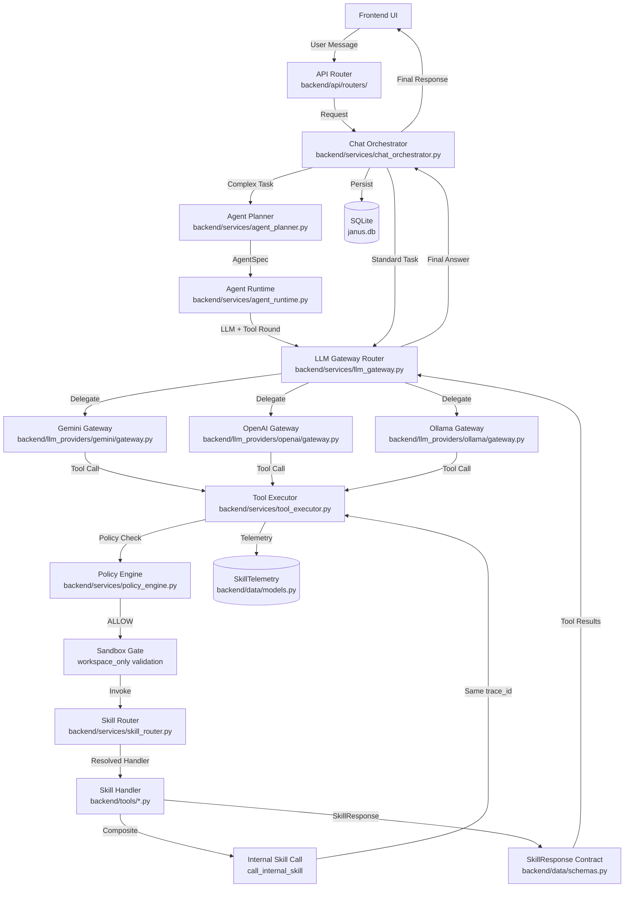

# Architektur & LLM-Provider (Janus)

## 1. System-Architektur (Code-Verifizierter Stand)

Janus ist ein hochmodularer, KI-gestützter persönlicher Assistent mit einer klaren Schichtenarchitektur. Das Backend folgt dem **Diamond-Standard** mit strikten Contracts zwischen allen Komponenten.

### 1.1 Datenfluss-Architektur (Mermaid)



### 1.2 Core-Komponenten (Verifiziert)

| Komponente | Datei | Verantwortlichkeit |
|------------|-------|-------------------|
| **Chat Orchestrator** | `backend/services/chat_orchestrator.py` | Zentrale Koordination von Context, Memory, Vision, Tool-Execution |
| **LLM Gateway** | `backend/services/llm_gateway.py` | Provider-Router (delegiert an Silo-Gateways) |
| **Gemini Gateway** | `backend/llm_providers/gemini/gateway.py` | Gemini-spezifische Orchestrierung, Websearch-Integration |
| **OpenAI Gateway** | `backend/llm_providers/openai/gateway.py` | OpenAI-spezifische Tool-Handling |
| **Ollama Gateway** | `backend/llm_providers/ollama/gateway.py` | Lokale LLM-Orchestrierung, Tool-Limit, Synthesis-Phase |
| **Base Gateway** | `backend/llm_providers/shared/base_gateway.py` | Abstrakte Basisklasse `BaseProviderGateway` |
| **Tool Executor** | `backend/services/tool_executor.py` | Ausführung, Policy/Sandbox, Rate-Limiting, Tracing |
| **Skill Router** | `backend/services/skill_router.py` | Auflösung Skill-ID → Handler |
| **Policy Engine** | `backend/services/policy_engine.py` | Sicherheitsentscheidungen (ALLOW, REQUIRE_CONSENT) |
| **Tool Manager** | `backend/services/tool_manager.py` | Tool-Registry, Capability-Discovery, Deprecation |
| **Agent Planner** | `backend/services/agent_planner.py` | Erstellt AgentSpec aus User-Intent |
| **Agent Runtime** | `backend/services/agent_runtime.py` | Führt AgentSpec in restricted Umgebung aus |

## 2. Provider-Silo-Architektur (Implementiert)

Die Provider-Silo-Refactoring-Roadmap wurde **vollständig implementiert**. Das monolithische Gateway wurde aufgeteilt:

### 2.1 Gateway-Router (`backend/services/llm_gateway.py`)

```python
silos = {
    "gemini": GeminiGateway(),
    "openai": OpenAIGateway(),
    "ollama": OllamaGateway()
}
```

Der Router delegiert an das jeweilige Provider-Silo basierend auf `provider_key`.

### 2.2 BaseProviderGateway (`backend/llm_providers/shared/base_gateway.py`)

```python
class BaseProviderGateway(ABC):
    @abstractmethod
    async def reason_and_respond(self, **kwargs) -> Dict[str, Any]:
        """Die Haupt-Orchestrierungsschleife des Providers."""
```

### 2.3 Provider-Spezifische Implementierungen

| Provider | Gateway | Service | Besonderheiten |
|----------|---------|---------|----------------|
| **Gemini** | `gemini/gateway.py` | `gemini/service.py` | Native Websearch, Diamond-Research-Modus (max 10 Tool-Rounds) |
| **OpenAI** | `openai/gateway.py` | `openai/service.py` | Native Websearch, strukturierte Outputs |
| **Ollama** | `ollama/gateway.py` | `ollama/service.py` | Tool-Limit (max 10), Intent-Matching, Synthesis-Phase |

## 3. Ollama-Spezifische Architektur

### 3.1 Tool-Limitierung mit Intent-Boost

```python
# backend/llm_providers/ollama/gateway.py
class OllamaGateway(BaseProviderGateway):
    def _limit_tools(
        self,
        tool_definitions: List[Dict[str, Any]],
        limit: int = 10,  # HARTES LIMIT
        user_prompt: str = "",
    ) -> List[Dict[str, Any]]:
        """Priorisiert fuer lokale Modelle die wichtigsten Tool-Familien."""
```

Priorisierungs-Reihenfolge:
1. Intent-boosted Skills (via `match_intent_to_skills()`)
2. `system.websearch`
3. `system.routing`
4. `system.local_business`
5. `filesystem.*`
6. `memory.*`
7. Restliche Tools

### 3.2 Ollama Service (`backend/llm_providers/ollama_service.py`)

- **Non-Native Tool Calls**: `_resolve_tool_calls_from_non_native_response()` normalisiert zu OpenAI-kompatiblen `tool_calls`
- **Self-Healing**: Bei JSON-Fehlern einmaliger Retry mit `format=json`
- **Markdown-Cleanup**: Fence-Cleanup für konsistente `raw_assistant_response`
- **Prompt-Größen-Logging**: `Ollama Start: Prompt-Groesse = X Zeichen.`
- **Latenz-Tracking**: `Ollama Ende: Antwort erhalten nach X.X Sekunden.`

### 3.3 Ollama Adapter (`backend/llm_providers/ollama_adapter.py`)

- Capability-Negotiation (`tool_blind`, `json_mode`, `streaming`)
- Skill-Affinity-Registry (Intent-Keywords, Fallback-Strategien)
- Deterministic Rendering Support

## 4. SkillResponse Contract

### 4.1 Schema (`backend/data/schemas.py:134`)

```python
class SkillResponse(BaseModel):
    status: Literal["ok", "error", "permission_required", "dry_run_success"]
    data: Any = None
    error: Optional[Dict[str, Any]] = None
```

### 4.2 Verwendung im ToolExecutor

Jeder Tool-Handler liefert ein `SkillResponse`-Objekt:

```python
# backend/services/tool_executor.py
class ToolExecutor:
    async def execute_tool_call(self, tool_name, tool_args, trace_id) -> Dict[str, Any]:
        # ... Ausführung ...
        return self._finalize_tool_result(
            original_name=original_name,
            skill_id=canonical_skill_id,
            payload=content_payload,  # SkillResponse
            started_at=started_at,
            trace_id=request_trace_id,
            arguments_json=raw_arguments,
            call_type="internal" if is_internal_call else "external",
        )
```

### 4.3 Error Codes (Standardisiert)

| Code | Bedeutung |
|------|-----------|
| `SKILL_NOT_FOUND` | Skill/Router konnte Skill nicht auflösen |
| `INVALID_ARGUMENTS` | Schema-Validierung fehlgeschlagen |
| `MISSING_CONTENT` | Pflichtparameter fehlt (z.B. PDF-Content) |
| `OPERATION_FAILED` | Allgemeiner Ausführungsfehler |
| `PERMISSION_DENIED` | Policy-Engine blockiert |
| `USER_CONSENT_NEEDED` | Consent-Dialog erforderlich |
| `RATE_LIMIT_EXCEEDED` | `max_calls_per_turn` überschritten |
| `SANDBOX_VIOLATION` | Pfad außerhalb erlaubter Workspaces |
| `TOOLS_DISABLED` | Executor läuft im disable_tools-Modus |
| `TOOL_NOT_ALLOWED_IN_PHASE` | Skill nicht in `allowed_skill_ids` |

## 5. Security & Policy Layer

### 5.1 Policy Engine (`backend/services/policy_engine.py`)

- Evaluiert Skills vor Ausführung
- Entscheidungen: `ALLOW`, `REQUIRE_CONSENT`
- Consent-Flow mit `system_grant_permission`

### 5.2 Sandbox-Enforcement

```python
# backend/services/tool_executor.py
sandbox_level = self.tool_manager.get_sandbox_level(skill_id)
if sandbox_level == "workspace_only":
    violation = self._get_sandbox_violation(func_args)
    # Prüft Path-Traversal, verbotene Pfade
```

### 5.3 Rate-Limiting (`max_calls_per_turn`)

```python
limit = self.tool_manager.get_max_calls_per_turn(skill_id)
current_count = per_skill_counts.get(skill_id, 0) + 1
if current_count > limit:
    return SkillResponse(status="error", error={"code": "RATE_LIMIT_EXCEEDED", ...})
```

## 6. Deep Tracing & Telemetry

### 6.1 SkillTelemetry Model (`backend/data/models.py`)

- `trace_id`: UUID pro Request (alle Tool-Calls teilen diese ID)
- `skill_id`: Kanonischer Skill-Name
- `arguments_json`: Input-Parameter
- `response_json`: Ausgabe-Response
- `latency_ms`: Ausführungszeit
- `success`: Boolean
- `error_code`: Optionaler Fehlercode
- `call_type`: `external` (LLM-getriggert) oder `internal` (Composite)

### 6.2 Tool Executor Integration

```python
self._record_skill_telemetry(
    trace_id=trace_id,
    skill_id=skill_id,
    success=success,
    latency_ms=elapsed_ms,
    error_code=error_code,
    arguments_json=arguments_json,
    response_json=final_payload,
    call_type=call_type,
)
```

## 7. Verzeichnisstruktur (Backend)

```
backend/
├── api/routers/           # FastAPI REST-Endpunkte
├── data/
│   ├── models.py          # SQLAlchemy ORM (SkillTelemetry, Message, ...)
│   ├── schemas.py         # Pydantic Models (SkillResponse, ToolArgs)
│   ├── crud.py            # DB-Operationen
│   └── database.py        # Session-Handling
├── llm_providers/
│   ├── shared/
│   │   └── base_gateway.py    # BaseProviderGateway ABC
│   ├── gemini/
│   │   ├── gateway.py         # GeminiGateway
│   │   └── service.py         # GeminiServiceProvider
│   ├── openai/
│   │   ├── gateway.py         # OpenAIGateway
│   │   └── service.py         # OpenAIServiceProvider
│   └── ollama/
│       ├── gateway.py         # OllamaGateway (Tool-Limit, Synthesis)
│       ├── service.py         # OllamaServiceProvider
│       └── ollama_adapter.py  # Capability Layer
├── services/
│   ├── chat_orchestrator.py   # Haupt-Orchestrierung
│   ├── llm_gateway.py         # Provider-Router
│   ├── tool_executor.py       # Tool-Ausführung + Security
│   ├── skill_router.py        # Skill-Name Resolution
│   ├── policy_engine.py       # Security-Entscheidungen
│   ├── tool_manager.py        # Tool-Registry
│   ├── agent_planner.py       # AgentSpec-Erstellung
│   ├── agent_runtime.py       # Agent-Ausführung
│   └── request_budget.py      # Phase-Budgets (Ollama)
├── skills/                    # Skill-Catalog (JSON)
└── tools/                     # Skill-Handler Implementierungen
```

## 8. Korrekturen zur alten Dokumentation

| Alte Annahme | Verifizierter Stand |
|--------------|---------------------|
| Provider-Silo-Refactoring ist Roadmap | **IMPLEMENTIERT** - `llm_gateway.py` ist jetzt ein Router |
| Ollama Adapter V2 existiert als Modul | **TEILWEISE** - `ollama_adapter.py` + `ollama/gateway.py` kombiniert |
| `agent_planner.py` + `agent_runtime.py` separat | **IMPLEMENTIERT** - Beide Dateien existieren, werden vom Orchestrator importiert |
| Tool-Limit für Ollama ist geplant | **IMPLEMENTIERT** - `_limit_tools(limit=10)` im OllamaGateway |
| `ollama_service.py` ist der Hauptpfad | **VERIFIZIERT** - 36.814 Bytes, enthält Self-Healing, Non-Native Tool Resolution |

## 9. Wichtige Code-Pfade

### 9.1 Chat-Request Flow

```
User Request
  → API Router (backend/api/routers/chat.py)
  → ChatOrchestrator.handle_chat_request()
  → use_agent_factory? → AgentPlanner → AgentRuntime
  → llm_gateway.reason_and_respond()
    → Provider-Silo.reason_and_respond()
      → Service.chat_completion_with_tools()
      → Tool-Call? → ToolExecutor.execute_tool_calls()
        → PolicyEngine.evaluate()
        → Sandbox-Check
        → Skill-Router
        → Skill Handler
        → SkillResponse
      → Synthesis (bei Ollama)
  → Persist in DB
  → Response to User
```

### 9.2 Composite Skill Flow

```
Skill Handler (z.B. knowledge.hardened_edit)
  → call_internal_skill(skill_id, args)
  → ToolExecutor.call_internal_skill()
    → Policy-Check (erneut!)
    → execute_tool_call(is_internal_call=True)
  → Nested Skill Handler
  → SkillResponse (gleiche trace_id)
```

---

*Dokumentation erstellt: 2026-03-24*  
*Code-Stand: Verifiziert gegen backend/ (Diamond-Standard)*
