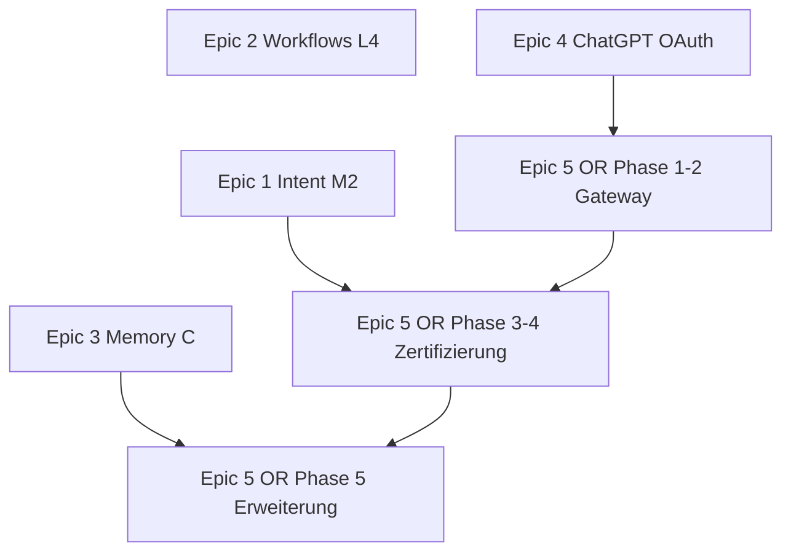

# Janus OpenRouter Provider — Feature-Spec & Umsetzungsplan

**Version:** 1.0.0  
**Datum:** 2026-07-07  
**Zielgruppe:** Codex / Cursor / Janus Diamond Pipeline  
**Status:** READY FOR IMPLEMENTATION (nach Epic 4 Transport Phase B)  
**Epic-ID:** `EPIC-PROVIDER-OPENROUTER-001`  

**Abgrenzung:** User-Provider-Epic — baut auf `PROVIDER_TRANSPORT_REFACTOR_SPEC.md` (Epic 4) auf.  
**Nicht starten vor:** Transport Phase B (`TRANSPORT_LAYER_ENABLED` auf Staging) **oder** explizitem Operator-Go mit dokumentierter technischer Schuld.

---

## 0. Executive Summary

### Problem

Janus-Nutzer wollen:

- **einen** zusätzlichen API-Key (OpenRouter) statt vieler Einzel-Provider-Keys,
- Zugang zu starken Modellen außerhalb des nativen OpenAI-/Gemini-Pfads (Claude, DeepSeek, Qwen, Kimi, GLM),
- **ohne** zu raten, welches Modell welche Janus-Funktion unterstützt.

Gleichzeitig ist es bereits schwer, Skills für **GPT und Gemini** konsistent zu halten. Eine ungefilterte OpenRouter-Modellliste würde das Problem multiplizieren.

### Lösung

Neuer Runtime-Provider **`openrouter`** mit **„Janus Certified“-Modellliste**:

- User hinterlegt **einen OpenRouter API-Key** in den Einstellungen
- Janus zeigt nur **kuratierte, zertifizierte** OR-Modelle
- **Jedes sichtbare Modell unterstützt volle Janus-Funktion** (alle relevanten Skills, Multi-Tool, Guards)
- Modelle, die die Conformance-Batterie nicht bestehen, erscheinen **nicht** in der UI

### Kernentscheidung

```text
✅ Certified-Only: kleine Liste, alles gleichwertig für den User
✅ Ein OpenAI-kompatibles OR-Pfad über `OpenAICompatTransport` (Epic 4)
✅ Pro Modell: identische Janus-Conformance-Batterie vor Freischaltung
❌ Keine vollständige OpenRouter-Katalog-Importierung
❌ Keine „Experimental“-Modelle in der normalen Chat-Auswahl
❌ Keine Abkopplung von Codex-Delegation-Tests als Ersatz für Runtime-Zertifizierung
```

### Aufwand / Risiko

| | Schätzung |
|---|-----------|
| Aufwand MVP (Gateway + Registry + 3–4 Launch-Modelle) | **2–3 Wochen** |
| Aufwand voll (8 Modelle + Conformance-CI) | **+1–2 Wochen** |
| Risiko | **Mittel** (Tool-Qualität variiert pro Modell; Zertifizierung ist Gate) |
| Nutzen | **Hoch** (mehr Modellwahl, ein Key, klare UX) |

---

## 1. Produktziel

### 1.1 User Story

> Als Janus-Nutzer möchte ich meinen OpenRouter-Key hinterlegen und aus einer **kleinen, vertrauenswürdigen** Modellliste wählen — und erwarten, dass **alles** funktioniert (Kalender, Memory, Kontakte, Recall, Multi-Step), egal welches Modell ich wähle.

### 1.2 Settings-UX (Ziel)

```text
Einstellungen → KI-Provider

OpenAI API-Key:        [········]     (bestehend)
Gemini API-Key:        [········]     (bestehend)
OpenRouter API-Key:    [········]     (neu)

Chat-Modell:
  ○ OpenAI (nativ)
  ○ Gemini (nativ)
  ○ OpenRouter — Janus Certified

  Modell: [ Claude Sonnet 4 ▼ ]
          ├─ Claude Sonnet 4          ⭐ Empfohlen
          ├─ Claude Haiku 3.5
          ├─ DeepSeek V3.1
          └─ …

  ℹ️ Alle Janus-Certified-Modelle unterstützen den vollen Funktionsumfang.
```

### 1.3 Was es löst / was nicht

| User-Frage | Antwort |
|------------|---------|
| „Ein Key für viele Modelle?“ | **Ja** (OpenRouter) |
| „Funktioniert Kalender/Memory mit jedem Modell?“ | **Ja** — nur zertifizierte Modelle sind sichtbar |
| „Kann ich jedes OR-Modell frei wählen?“ | **Nein** — nur Janus Certified |
| „Ersetzt OR meine OpenAI/Gemini-Keys?“ | **Nein** — optionaler dritter Pfad |
| „Embeddings?“ | **Weiter separat** (OpenAI o.ä.) — OR deckt Chat/Tool-Loop ab |

### 1.4 Abgrenzung zu Codex-OR-Delegation

| Bereich | Codex OR (heute) | Dieses Epic (Runtime) |
|---------|------------------|------------------------|
| Kontext | Bounded Dev-Skills, Review, Draft | **Voller Janus-Chat + Orchestrator** |
| Tool-Loop | Teilweise / assist-only | **Vollständig** (~55 Skills) |
| Zertifizierung | Pro Lane / Skill-Klasse | **Einheitliche Full-JanUS-Batterie** |
| User-sichtbar | Operator/Codex | **End-User Settings** |

Bestehende OR-Evidence aus `documentation/codex/model-routing/` ist **Input**, aber **kein Freifahrtschein** für Runtime-Zertifizierung.

---

## 2. Architektur

### 2.1 Ist-Zustand

```text
Settings → Keyring (provider: "openai" | "gemini")
    → OpenAIServiceProvider / GeminiServiceProvider
    → Tool-Loop → tool_executor → Janus Skills
```

OpenRouter existiert heute **nur** in der Codex-Delegation-Pipeline (`documentation/codex/model-routing/`), nicht als End-User-Runtime-Provider.

**Relevante Dateien heute:**

| Datei | Rolle |
|-------|-------|
| `backend/api/routers/system.py` | API-Key CRUD via Keyring |
| `backend/llm_providers/openai/service.py` | OpenAI Calls + Tool-Normalisierung |
| `backend/llm_providers/gemini/gateway.py` | Gemini Tool-Compiler |
| `backend/llm_providers/shared/base_provider.py` | `BaseLLMProvider` ABC |
| `backend/llm_providers/shared/moa.py` | `MOA_MODEL_HIERARCHY` |
| `backend/services/tool_manager.py` | `optimal_model_tier` pro Skill |
| `backend/config/model_routing.json` | Tier-Mappings |
| `frontend/js/settings.js` | Provider-Key UI |

### 2.2 Soll-Zustand

```text
Settings → Keyring (provider: "openrouter")
    → OpenRouterServiceProvider
    → AsyncOpenAI(base_url="https://openrouter.ai/api/v1")
    → Gleicher Tool-Loop wie OpenAI (openai_compatible Adapter)
    → Model aus Janus Certified Registry
```

```text
User wählt OR-Modell
    → Registry-Lookup (certified == true)
    → MOA-Tiers für openrouter-Provider
    → SkillSelector (unverändert — kein Skill-Filter pro Modell nötig)
    → Gateway + Tool-Loop
```

**Design-Prinzip:** Certified-Modelle sind **funktional gleichwertig**. Kein `min_capability_class` in der User-UI — die Klasse existiert nur intern während der Zertifizierung.

### 2.3 Neue Komponenten

```
backend/llm_providers/openrouter/
    service.py              # OpenRouterServiceProvider (extends/wraps OpenAI path)
    gateway.py              # Thin wrapper, OR-spezifische Headers
    registry.py             # Certified model lookup + validation

backend/config/openrouter_certified_models.json   # Kanonische Modellliste
backend/config/openrouter_moa_hierarchy.json      # speed/logic/escalation pro OR-Modell

backend/services/conformance/
    openrouter_conformance_runner.py   # Zertifizierungs-Batterie (Dev/CI)
    fixtures/                          # Test-Prompts + erwartete Tool-Calls

backend/api/routers/openrouter.py     # Optional: Key-Test, Modellliste
frontend/js/openrouter-settings.js    # Key + Modell-Dropdown

backend/tests/test_openrouter_provider.py
backend/tests/test_openrouter_registry.py
backend/tests/test_openrouter_conformance_smoke.py
```

### 2.4 Was NICHT geändert wird

- `tool_executor`, Skill-JSONs, `CapabilityRegistry` (keine per-Modell-Skill-Filter)
- `IntentEngine`, Memory-Guards, Contact-Safety
- Bestehende `openai` / `gemini` Provider-Pfade
- Codex-Delegation-OR-Pipeline (bleibt parallel)

### 2.5 OpenRouter-spezifische API-Details

```python
client = AsyncOpenAI(
    api_key=openrouter_key,
    base_url="https://openrouter.ai/api/v1",
    default_headers={
        "HTTP-Referer": "https://janus.local",  # OR-Empfehlung
        "X-Title": "Janus",
    },
)
```

Tool-Format: **OpenAI-compatible** (`tools` + `tool_choice`). Kein separates Gateway pro Modell-Familie — Zertifizierung stellt sicher, dass jedes Certified-Modell damit klarkommt.

---

## 3. Janus Certified Model Registry

### 3.1 Schema (`openrouter_certified_models.json`)

```json
{
  "schema_version": 1,
  "updated_at": "2026-07-07",
  "models": [
    {
      "id": "anthropic/claude-sonnet-4",
      "display_name": "Claude Sonnet 4",
      "family": "claude",
      "tier_default": "logic",
      "certified": true,
      "certified_at": "2026-07-07",
      "certified_version": "conformance-v1",
      "launch_tier": "recommended",
      "notes": "Premium Allrounder; stärkster Launch-Kandidat"
    },
    {
      "id": "deepseek/deepseek-chat-v3.1",
      "display_name": "DeepSeek V3.1",
      "family": "deepseek",
      "tier_default": "logic",
      "certified": false,
      "certified_at": null,
      "certified_version": null,
      "launch_tier": "candidate",
      "notes": "Starke Codex-Evidence; Runtime-Batterie ausstehend"
    }
  ]
}
```

### 3.2 Registry-Regeln

| Regel | Beschreibung |
|-------|--------------|
| **R1** | Nur `certified: true` erscheint im User-Dropdown |
| **R2** | `certified_version` muss aktuelle Batterie-Version matchen |
| **R3** | Modell-Entzug: `certified: false` + UI-Hinweis bei nächstem Start |
| **R4** | Kein Runtime-Import der vollen OR-Katalog-API in die UI |
| **R5** | Operator kann Registry per Release aktualisieren (kein Hot-Pull im MVP) |

### 3.3 Ziel-Modell-Familien (User-Wunsch)

| Familie | Beispiel-Slugs (OR) | Launch-Priorität | Vorhandene Janus-Evidence |
|---------|---------------------|------------------|---------------------------|
| **Claude** | `anthropic/claude-sonnet-4`, `anthropic/claude-3.5-haiku` | **P0 Launch** | Wenig Runtime; starkes Tool-Calling erwartet |
| **DeepSeek** | `deepseek/deepseek-chat-v3.1`, `deepseek/deepseek-v4-flash` | **P0 Launch** | Execution/Quickchange PASS in Codex-Pipeline |
| **Qwen (größer)** | `qwen/qwen3-coder-30b-a3b-instruct`, `qwen/qwen-max` | **P1** | Assist-Lanes PASS; Flash-Varianten Schema-Fails |
| **Kimi** | `moonshotai/kimi-k2.5`, `moonshotai/kimi-k2.6` | **P1** | Family-Shortlist; Length/Cost-Issues in Docs-Tests |
| **GLM** | `z-ai/glm-5-turbo`, `z-ai/glm-5.1` | **P2** | Inventory vorhanden; Runtime ungetestet |

**Hinweis GLM 5.2:** Zum Spec-Datum ist `glm-5.1` / `glm-5-turbo` im lokalen OR-Inventory referenziert. `glm-5.2` wird als **Kandidat** geführt — Zertifizierung erst nach Verfügbarkeit + Batterie-PASS.

---

## 4. Conformance-Batterie (Full Janus)

### 4.1 Zweck

Einheitlicher Gatekeeper: **Modell X darf in die UI**, wenn und nur wenn alle Pflicht-Tests PASS.

Dies ist **strenger** als die bestehende Codex-OR-Delegation (Text/Review/Bounded-Patch).

### 4.2 Test-Matrix

| ID | Name | Was geprüft wird | Pflicht |
|----|------|------------------|---------|
| **C01** | `chat_baseline` | Einfacher Chat ohne Tools, Deutsch | ✅ |
| **C02** | `tool_forcing_single` | `memory_read` mit `tool_choice: required` | ✅ |
| **C03** | `calendar_list` | `calendar.list_events` korrekte Args | ✅ |
| **C04** | `calendar_mutate` | Termin anlegen + bestätigen (Staging-Fixture) | ✅ |
| **C05** | `multi_tool_turn` | ≥2 Tool-Calls in einem Turn | ✅ |
| **C06** | `contact_resolve_de` | Deutscher Kontaktname + Umlaute | ✅ |
| **C07** | `recall_natural` | Natürliche Recall-Formulierung (Intent-abhängig) | ✅ |
| **C08** | `medical_guard` | Medical-Guard nicht umgehbar | ✅ |
| **C09** | `moa_escalation` | speed→logic Eskalation bei komplexem Skill | ✅ |
| **C10** | `long_context_tools` | Tool-Call nach ~8k Token Kontext | ✅ |
| **C11** | `error_recovery` | Retry nach fehlgeschlagenem Tool-Args | Optional v1.1 |

**Exit-Kriterium Zertifizierung:** **C01–C10 alle PASS** auf Staging mit produktionsnahem Skill-Set.

### 4.3 Ausführung

```text
Operator / CI:
  openrouter_conformance_runner.py --model anthropic/claude-sonnet-4 --battery v1
    → JSON-Report + PASS/FAIL pro Case
    → Bei PASS: Registry-Eintrag certified=true (manueller Review-Commit)
```

**Kosten-Kontrolle:**

- Batterie einmal pro Modell-Version (~$2–15 je nach Modell)
- Re-Run nur bei: Janus-Skill-Änderung, OR-Modell-Update, Batterie-Version-Bump

### 4.4 Batterie-Versionierung

```text
conformance-v1  → Initial (dieses Epic)
conformance-v2  → + Workflows, + Session-Search (nach Epic 2+3)
```

Wenn Batterie-Version steigt: **alle** Certified-Modelle müssen re-zertifiziert werden, bevor `certified_version` aktualisiert wird.

### 4.5 Abhängigkeit von Intent-Epic

**C07 (Recall)** und Teile von **C06 (Kontakt)** hängen von Intent-Qualität ab.

| Situation | Empfehlung |
|-----------|------------|
| Intent Epic **nicht** abgeschlossen | C07 mit **fixture-forced** Intent (Test-Modus), nicht als Blocker |
| Intent Epic **abgeschlossen** (M2) | C07 als **Live-Intent**-Test — realistischere Zertifizierung |

**Start-Empfehlung:** Epic 5 **nach** Intent M2, damit Zertifizierung nicht auf bekannt schwachem Routing basiert.

---

## 5. Launch-Modell-Plan

### 5.1 Phase 1 — Launch (3–4 Modelle)

Ziel: Schneller Nutzen, hohe Confidence.

| Modell | Rolle | Begründung |
|--------|-------|------------|
| `anthropic/claude-sonnet-4` | Premium Default | Zuverlässigstes Tool-Calling, starkes Deutsch |
| `anthropic/claude-3.5-haiku` | Günstiger Claude | Gute Balance Preis/Qualität |
| `deepseek/deepseek-chat-v3.1` | Value-Option | Günstig, starke Reasoning-Evidence |
| `deepseek/deepseek-v4-flash` | Speed-Option | Bereits Execution-PASS in Codex-Pipeline |

**Launch-Exit:** 4/4 bestanden C01–C10, UI live hinter Flag.

### 5.2 Phase 2 — Erweiterung (+3–4 Modelle)

| Modell | Familie | Voraussetzung |
|--------|---------|---------------|
| `qwen/qwen3-coder-30b-a3b-instruct` | Qwen | C05+C06 PASS (kein Flash-Envelope-Fail) |
| `qwen/qwen-max` | Qwen | Separat zertifizieren |
| `moonshotai/kimi-k2.5` | Kimi | Length-Limits + Kosten im Test protokollieren |
| `z-ai/glm-5-turbo` | GLM | C06 Deutsch-Kontakt explizit PASS |

### 5.3 Phase 3 — Optional Premium

| Modell | Rolle |
|--------|-------|
| `anthropic/claude-opus-4` | Maximum Quality |
| `moonshotai/kimi-k2.6` | Alternative Reasoning |

**Maximale Certified-Liste:** **8–10 Modelle** — bewusst klein gehalten.

---

## 6. MOA & Skill-Integration

### 6.1 `MOA_MODEL_HIERARCHY` erweitern

```json
{
  "openrouter": {
    "speed": { "model": "deepseek/deepseek-v4-flash" },
    "logic": { "model": "anthropic/claude-sonnet-4" },
    "escalation": { "model": "anthropic/claude-sonnet-4" }
  }
}
```

Pro Certified-Modell können User-gewähltes Modell und MOA-Tiers koexistieren:

- User wählt **Default-Chat-Modell**
- MOA eskaliert innerhalb **derselben Certified-Liste** (nicht auf nicht-zertifizierte Modelle)

### 6.2 `optimal_model_tier` in Skills

Skills behalten `optimal_model_tier` — neuer Provider-Key `openrouter`:

```json
{
  "optimal_model_tier": {
    "openai": "logic",
    "gemini": "speed",
    "openrouter": "logic"
  }
}
```

Kein neues Feld `min_capability_class` nötig — Certified-Gate ersetzt das für OR.

### 6.3 Orchestrator-Integration

```python
def resolve_provider(user_settings) -> str:
    if user_settings.chat_provider == "openrouter":
        assert registry.is_certified(user_settings.openrouter_model_id)
        return "openrouter"
    ...
```

`wf.api_key` → für OR: `openrouter` Key aus Keyring. Bestehende OpenAI/Gemini-Pfade unverändert.

---

## 7. Feature-Flags

```python
OPENROUTER_PROVIDER_ENABLED = os.getenv("OPENROUTER_PROVIDER_ENABLED", "false").lower() == "true"
OPENROUTER_CERTIFIED_ONLY = os.getenv("OPENROUTER_CERTIFIED_ONLY", "true").lower() == "true"  # nie false in Prod
OPENROUTER_CONFORMANCE_CI_ENABLED = os.getenv("OPENROUTER_CONFORMANCE_CI_ENABLED", "false").lower() == "true"
```

| Flag | Default bis Prod | Bedeutung |
|------|------------------|-----------|
| `OPENROUTER_PROVIDER_ENABLED` | `false` | Gesamter OR-Provider |
| `OPENROUTER_CERTIFIED_ONLY` | `true` | Nur Registry-Modelle (Pflicht) |
| `OPENROUTER_CONFORMANCE_CI_ENABLED` | `false` | CI-Zertifizierungsläufe |

---

## 8. Phasen

### Phase 1 — Gateway + Keyring (4–5 Tage)

- [ ] `OpenRouterServiceProvider` — OpenAI-kompatibel, OR-Headers
- [ ] Keyring: `provider: "openrouter"` in `system.py`
- [ ] Registry-Loader + `is_certified()` Guard
- [ ] Tests: Mock-API, Key-CRUD, uncertified model blocked

### Phase 2 — UI + Orchestrator (3–4 Tage)

- [ ] Settings: OR-Key + Provider-Radio + Modell-Dropdown (nur certified)
- [ ] Orchestrator: Provider-Routing `openrouter`
- [ ] `MOA_MODEL_HIERARCHY` + `model_routing.json` Einträge
- [ ] Tests: End-to-End Smoke mit Mock

### Phase 3 — Conformance Runner (3–4 Tage)

- [ ] `openrouter_conformance_runner.py` + Fixtures C01–C10
- [ ] JSON-Report-Format + PASS/FAIL-Dokumentation
- [ ] Operator-Playbook: „Neues Modell zertifizieren“

### Phase 4 — Launch-Zertifizierung (3–5 Tage, parallel zu 1–3)

- [ ] Live-Batterie: 4 Launch-Modelle
- [ ] Registry-Commit: `certified: true` für PASS-Modelle
- [ ] Staging-Live-Retest (siehe §9)
- [ ] `janus-final-audit` PASS

### Phase 5 — Erweiterung (optional, +1–2 Wochen)

- [ ] Phase-2-Modelle (Qwen, Kimi, GLM) zertifizieren
- [ ] `conformance-v2` nach Workflows + Session-Search

---

## 9. Live-Retest-Szenarien (Staging)

| ID | Szenario | Erwartung |
|----|----------|-----------|
| **OR-L1** | OR-Key speichern + Modell wählen | Settings persistiert |
| **OR-L2** | „Wie wird das Wetter morgen?“ | `system.weather` Tool-Call |
| **OR-L3** | „Was weißt du über mich?“ | `memory_read` |
| **OR-L4** | „Termin morgen 10 Uhr Arzt“ | Kalender-Create + Confirm |
| **OR-L5** | „Ruf Anna an“ (Kontakt DE) | Contact-Resolve |
| **OR-L6** | Multi-Step: Wetter + Termin | ≥2 Tools |
| **OR-L7** | Modellwechsel Claude ↔ DeepSeek | Gleiche Funktion |
| **OR-L8** | Uncertified Slug manuell (API) | **403 / blocked** |

**Exit:** 8/8 auf mindestens einem Launch-Modell; 4/4 Launch-Modelle bestehen C01–C10.

---

## 10. Risiken & Mitigationen

| Risiko | Impact | Mitigation |
|--------|--------|------------|
| Modell besteht Zertifizierung, bricht später | Hoch | `certified_version` + Re-Run bei Janus-Updates |
| OR ändert Modell-Verhalten | Mittel | Pin auf getestete Modell-Revision; Monitoring |
| Kosten-Überraschung (Kimi, Opus) | Mittel | UI: ungefähre Kosten/1k; Default auf günstigeres Modell |
| Deutsch/Kontakt schwach (GLM, OSS) | Hoch | C06 Pflicht; kein Launch ohne PASS |
| Doppelte Provider-Komplexität | Mittel | Ein Adapter; Certified-Only reduziert Test-Matrix |
| Intent schwach → C07 Fail | Mittel | Epic 1 vor Epic 5; Fixture-Modus als Übergang |

---

## 11. Abhängigkeiten



| Abhängigkeit | Stärke | Begründung |
|--------------|--------|------------|
| Intent M2 | **Empfohlen** | C07 Recall realistisch testbar |
| Memory C | Weich | Session-Search in conformance-v2 |
| Workflows L4 | Weich | Routine-Trigger in conformance-v2 |
| ChatGPT OAuth | Keine harte | Parallel möglich nach M4 |
| Codex OR Pipeline | Keine | Wiederverwendet nur Evidence |

---

## 12. Out of Scope (v1)

- Vollständiger OpenRouter-Katalog in der UI
- „Experimental“-Modell-Tier für End-User
- OpenRouter für Embeddings
- Automatisches Zertifizieren neuer OR-Modelle ohne Operator-Review
- Ersetzen von nativem OpenAI/Gemini
- OpenRouter MCP als Runtime-Execution-Path
- Per-Modell unterschiedliche Skill-Sets in der UI

---

## 13. Erfolgsmetriken

| Metrik | Ziel |
|--------|------|
| Launch-Modelle zertifiziert | **≥4** |
| C01–C10 Pass-Rate pro Launch-Modell | **100%** |
| OR-L1–L8 Staging | **8/8** |
| User-sichtbare Modell-Anzahl | **≤10** |
| Skill-Regression vs. GPT/Gemini Baseline | **Keine Verschlechterung** auf Certified-Modellen |
| Support-Anfragen „Modell X geht nicht“ | **≈0** (durch Certified-Only) |

---

## 14. Operator-Playbook: Neues Modell zertifizieren

```text
1. Modell in openrouter_certified_models.json als candidate eintragen (certified: false)
2. openrouter_conformance_runner.py --model <slug> --battery v1
3. Report prüfen — alle C01–C10 PASS?
4. Bei PASS: certified=true, certified_at, certified_version setzen
5. MOA-Hierarchy ergänzen
6. Staging OR-L1–L8
7. janus-final-audit PASS
8. Registry-Commit + Release-Notes
```

**Bei FAIL:** Modell bleibt unsichtbar. Kein „Experimental“-Bypass in v1.

---

## 15. Codex-Startprompt

```text
Implementiere Epic 5 Phase 1+2 aus documentation/Cursor specs/OPENROUTER_PROVIDER_SPEC.md

Constraints:
- OPENROUTER_CERTIFIED_ONLY=true
- Nur Registry-Modelle in UI
- OpenAI-kompatibles Gateway, kein Volllisten-Import
- Bestehende openai/gemini Pfade unverändert
```

---

## 16. Entscheidungslog

| Datum | Entscheidung |
|-------|--------------|
| 2026-07-07 | Epic 5: Certified-Only OR — kleine Liste, volle Janus-Funktion pro Modell |
| 2026-07-07 | Kein Experimental-Tier in User-UI v1 |
| 2026-07-07 | Launch: Claude Sonnet/Haiku + DeepSeek V3.1/v4-flash |
| 2026-07-07 | Erweiterung: Qwen, Kimi, GLM nach Zertifizierung |
| 2026-07-07 | Conformance C01–C10 als Gate; Codex-Evidence nur als Vorfilter |
| 2026-07-07 | Start nach Epic 1–4 empfohlen; harter Gate vor Intent M2 nur mit Fixture-Modus |

---

**END OF SPEC**
