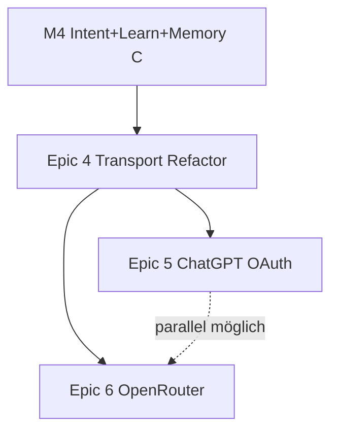

# Janus Provider Transport Refactor — Architektur-Spec & Umsetzungsplan

**Version:** 1.0.0
**Datum:** 2026-07-07
**Zielgruppe:** Codex / Cursor / Janus Diamond Pipeline
**Status:** READY FOR IMPLEMENTATION (nach M4 oder explizitem Operator-Go)
**Epic-ID:** `EPIC-ARCH-TRANSPORT-001`

**Abgrenzung:** Infrastruktur-Epic — kein neues User-Feature. Legt die Basis für Epic 5 (OAuth) und Epic 6 (OpenRouter).
**Nicht starten vor:** Abschluss `ROADMAP_EPIC_ORDER.md` Meilenstein M4 (Intent + Learn + Memory C) **oder** explizitem Operator-Go.

**Vorgänger-Analyse:** Architektur-Review 2026-07-07 (Janus vs. Hermes Provider-Modell).

---

## 0. Executive Summary

### Problem

Janus soll **provider-agnostisch und universell** sein — OpenAI, Gemini, später OpenRouter, Anthropic, lokale Modelle. In der Praxis:

- Skills und ToolExecutor sind weitgehend provider-neutral ✅
- **Orchestrator, Gateways und Features** (Websearch, Synthesis) enthalten **40+ Provider-Branches** ❌
- OpenAI- und Gemini-Gateway duplizieren den Tool-Loop ❌
- Zwei widersprüchliche Modell-Hierarchien (`MOA_MODEL_HIERARCHY` vs. `ChatOrchestrator.MODEL_HIERARCHY`) ❌
- Streaming in `execution_engine` umgeht Gateways ❌

**Ergebnis:** Jeder neue Provider fühlt sich an wie „jeden Skill für GPT und Gemini anpassen“ — obwohl das eigentlich ein **Adapter-Problem** ist.

### Lösung (Hermes-inspiriert)

Provider-Unterschiede in **3–4 API-Familien-Transports** kapseln — nicht pro Provider ein Gateway:

```text
api_mode / Transport:
  openai_compat     → OpenAI, OpenRouter, DeepSeek, Kimi-via-OR, Ollama (tools)
  gemini_native     → Gemini API
  anthropic_native  → Claude API (direkt, optional)
  codex_responses   → ChatGPT OAuth (Epic 5)
```

Ein **`ToolLoopRunner`** für den gesamten Tool-Loop. Skills bleiben unverändert.

### Kernentscheidung

```text
✅ Transport pro API-Familie, nicht pro Provider
✅ Ein ToolLoopRunner — Gateways werden dünner
✅ Tool-Namen-Normalisierung nur an der Transport-Grenze
✅ Eine kanonische MODEL_HIERARCHY
❌ Kein fünftes copy-paste Gateway für OpenRouter
❌ Kein Big-Bang-Rewrite — strangweise Migration hinter Flags
```

### Aufwand / Risiko

| | Schätzung |
|---|-----------|
| Phase A (Konsolidierung) | **1–1,5 Wochen** |
| Phase B (Transport-Schicht) | **1–1,5 Wochen** |
| Phase C (Entkopplung + Cleanup) | **3–5 Tage** |
| **Gesamt** | **2,5–3,5 Wochen** |
| Risiko | **Mittel-Hoch** (Kern-Orchestrator — harte Regression-Tests nötig) |
| Nutzen | **Sehr hoch** — jeder weitere Provider wird ~Tage statt ~Wochen |

---

## 1. Ist-Zustand (Diagnose)

### 1.1 Was bereits provider-agnostisch ist

| Schicht | Dateien | Bewertung |
|---------|---------|-----------|
| Skill JSON | `backend/skills/**/*.json` | ✅ Kanonischer Vertrag |
| ToolManager | `backend/services/tool_manager.py` | ✅ Ein Schema (Name-Sanitize ist Leak — siehe §1.2) |
| ToolExecutor | `backend/services/tool_executor.py` | ✅ Bis auf Websearch |
| Prevalidation | `backend/llm_providers/shared/utils.py` | ✅ `_prevalidate_tool_calls` |
| CapabilityRegistry | `backend/services/capability_registry.py` | ✅ UX-only, nicht Runtime |

### 1.2 Wo Provider-Logik geleakt ist

| Hotspot | Problem |
|---------|---------|
| `openai/gateway.py` + `gemini/gateway.py` | Duplizierter Tool-Loop (~70% identisch) |
| `chat_orchestrator.py` | Eigene `MODEL_HIERARCHY`, `META_PROVIDER_PROFILES`, Vision-Branches |
| `execution_engine.py` | Streaming bypass: direkte `OpenAIServiceProvider` / `GeminiServiceProvider` |
| `tool_executor.py` | ~90 Zeilen Websearch Provider/Model-Coercion |
| `tool_manager.get_tool_definitions()` | Global Gemini-Name-Sanitize für alle Provider |
| `MOA_MODEL_HIERARCHY` vs. `ChatOrchestrator.MODEL_HIERARCHY` | Drift (z.B. balanced: nano vs. mini) |
| `gemini/service.py` | Schema-Cleaning, proto bridge, thought signatures |
| `openai/service.py` | Tool-Name-Shim, forced-tool re-injection |

### 1.3 Architektur-Diagramm heute

```text
                    ┌─────────────────────────────────┐
                    │       chat_orchestrator         │
                    │  MODEL_HIERARCHY (duplicate)    │
                    └────────────┬────────────────────┘
                                 │
              ┌──────────────────┼──────────────────┐
              ▼                  ▼                  ▼
      OpenAIGateway        GeminiGateway       OllamaGateway
      (tool loop)          (tool loop)         (tool loop)
              │                  │                  │
              ▼                  ▼                  ▼
      OpenAIService        GeminiService        OllamaService
              │                  │                  │
              └──────────────────┼──────────────────┘
                                 ▼
                          tool_executor
                                 ▼
                            skills/**/*
```

**Problem:** Horizontale Duplikation + vertikale Provider-Branches im Orchestrator.

---

## 2. Ziel-Architektur (Soll)

### 2.1 Hermes-Vorbild

Hermes trennt strikt:

```text
AIAgent (ein Loop)
    → runtime_provider.resolve(provider, model) → api_mode + credentials
    → Transport (Format-Konvertierung + HTTP)
    → tools/registry (provider-blind)
```

Janus-Äquivalent:

```text
ChatOrchestrator / ExecutionEngine
    → runtime_llm.resolve(provider, model) → api_mode + credentials
    → ToolLoopRunner (einmal)
        → Transport.send(messages, tools) → normalized response
        → tool_executor (unverändert)
        → Transport.prepare_history(...) → nächste Runde
```

### 2.2 API-Modi (Janus)

| `api_mode` | Transport-Klasse | Provider-Beispiele |
|------------|------------------|-------------------|
| `openai_compat` | `OpenAICompatTransport` | `openai`, `openrouter`, künftige OR-Modelle |
| `gemini_native` | `GeminiNativeTransport` | `gemini` |
| `anthropic_native` | `AnthropicNativeTransport` | `anthropic` (optional, Epic 6+) |
| `codex_responses` | `CodexResponsesTransport` | `openai-codex` (Epic 5) |
| `ollama_local` | `OllamaLocalTransport` | `ollama` |

**Regel:** Neuer OpenRouter-Slug = **kein** neuer Transport. Neues Gemini-API-Format = **ein** Transport-Update.

### 2.3 Ziel-Diagramm

```text
┌──────────────────────────────────────────────────────────────┐
│  ChatOrchestrator / ExecutionEngine                          │
│  runtime_llm.resolve()  ·  MOA_MODEL_HIERARCHY (eine Quelle) │
└────────────────────────────┬─────────────────────────────────┘
                             ▼
┌──────────────────────────────────────────────────────────────┐
│  ToolLoopRunner                                              │
│  prevalidate → execute → history → MoA → max_rounds            │
└────────────────────────────┬─────────────────────────────────┘
                             ▼
┌──────────────┬──────────────┬──────────────┬─────────────────┐
│ openai_compat│ gemini_native│ollama_local  │ codex_responses  │
│ Transport    │ Transport    │ Transport    │ (Epic 5)        │
└──────────────┴──────────────┴──────────────┴─────────────────┘
                             ▼
                      tool_executor → skills
```

### 2.4 Kanonisches internes Format

Alle Transports sprechen **intern** dasselbe Format:

```python
# Tool-Definition (outbound)
InternalToolDef = {
    "skill_id": "system.weather",      # kanonisch mit Punkt
    "llm_name": "system_weather",      # transport-spezifisch, nur am Rand
    "description": "...",
    "parameters": {...}
}

# Tool-Call (inbound)
InternalToolCall = {
    "skill_id": "system.weather",      # immer kanonisch nach Normalisierung
    "arguments": {...},
    "call_id": "..."
}
```

**`ToolCallAdapter`** (neu, `backend/llm_providers/shared/tool_call_adapter.py`):

| Richtung | Verantwortung |
|----------|---------------|
| Outbound | `skill_id` → `llm_name` (pro api_mode) |
| Inbound | `llm_name` → `skill_id` |
| Nur hier | Punkt/Unterstrich, Gemini-Schema-Cleaning |

`tool_manager.get_tool_definitions()` liefert künftig **kanonische** IDs; der Transport entscheidet über `llm_name`.

### 2.4.1 T-A2 implementation status

- `TASK-M6.2` final audit: `PASS WITH FIXES` (`documentation/tasks/TASK-M6.2_final_audit.md`).
- Completed scope: `ToolManager` preserves canonical dotted skill IDs while `ToolCallAdapter` owns the OpenAI/Gemini outbound, inbound, history, and schema adaptation seams. Focused adapter/OpenAI/Gemini checks and manual Gemini weather-tool evidence passed.
- Non-blocking follow-up: Cursor Composer execution remains proposal-first only. Its shared delegate/worker wrapper contract and structured-output timeout require a separate infrastructure debug slice before Cursor can be treated as autonomous/productive.
- Spec status remains in progress: `T-A3` through `T-A5` remain separate, open Phase-A tasks.

---

## 3. Komponenten (neu / refactored)

### 3.1 Dateistruktur (Ziel)

```
backend/llm_providers/
├── shared/
│   ├── base_transport.py          # ABC: send, prepare_history, normalize_tools
│   ├── tool_call_adapter.py       # skill_id ↔ llm_name
│   ├── tool_loop_runner.py        # extrahiert aus Gateways
│   ├── moa.py                     # einzige MODEL_HIERARCHY-Quelle
│   └── utils.py                   # prevalidate (bleibt)
├── transports/
│   ├── openai_compat.py           # OpenAI + OR + kompatible
│   ├── gemini_native.py
│   ├── ollama_local.py
│   └── codex_responses.py         # Epic 5
├── runtime_llm.py                 # resolve(provider, model) → api_mode, creds
├── openai/service.py              # wird von Transport genutzt (dünner)
├── gemini/service.py
└── ollama/service.py

backend/services/llm_gateway.py    # delegiert an ToolLoopRunner + Transport
```

### 3.2 `runtime_llm.resolve()`

Zentral wie Hermes `runtime_provider.py`:

```python
def resolve_runtime_llm(
    provider: str,
    model: str,
    *,
    auth_mode: str = "api_key",
) -> ResolvedLLM:
    """
    Returns:
        api_mode, api_key/base_url, transport_class, model_id
    """
```

| Input | Output |
|-------|--------|
| `openai`, `gpt-5.4-mini` | `openai_compat`, OpenAI key |
| `gemini`, `gemini-3-flash-preview` | `gemini_native`, Gemini key |
| `openrouter`, `anthropic/claude-sonnet-4` | `openai_compat`, OR key + OR base_url |
| `ollama`, `llama3` | `ollama_local`, no key |
| `openai-codex`, `gpt-5.x` | `codex_responses`, OAuth token (Epic 5) |

### 3.3 `ToolLoopRunner`

Extrahiert aus `openai/gateway.py` und `gemini/gateway.py`:

```python
class ToolLoopRunner:
  async def run(
    self,
    transport: BaseTransport,
    *,
    messages, tools, tool_choice,
    allowed_skill_ids, max_tool_rounds,
    tool_executor, moa_context,
  ) -> ToolLoopResult:
```

**Enthält (provider-neutral):**
- MoA model resolution
- `_prevalidate_tool_calls`
- Round loop + `tool_executor.execute_tool_calls`
- `transport.prepare_history_for_second_call`
- max_rounds / list-query bump (konfigurierbar pro Transport, nicht hardcoded)

**Enthält NICHT:**
- Prompt-Compiler (bleibt Transport/Domain-Hook)
- Provider-spezifische Synthesis (Post-Processor, siehe §3.5)

### 3.4 Eine `MODEL_HIERARCHY`

**Entscheidung:** `MOA_MODEL_HIERARCHY` in `shared/moa.py` wird **einzige Quelle**.

| Aktion | Datei |
|--------|-------|
| Entfernen | `ChatOrchestrator.MODEL_HIERARCHY` |
| Migrieren | Alle Imports → `MOA_MODEL_HIERARCHY` |
| Erweitern | Keys für `openrouter` (Epic 6), Platzhalter für `anthropic` |

Drift-Test in CI: `test_model_hierarchy_single_source.py`.

### 3.4.1 Phase-A Migrationsentscheidung: aktive Hierarchie bleibt verhaltensgleich

**Entscheidung (2026-07-11):** Die Phase-A-Konsolidierung bewahrt die aktuell aktive `ChatOrchestrator.MODEL_HIERARCHY` verhaltensgleich. Ihre Werte werden vollstaendig in `MOA_MODEL_HIERARCHY` migriert; danach ist MoA die einzige Laufzeitquelle.

| Provider | Kanonische Tier-Werte nach T-A1 |
|---|---|
| `openai` | `vision=gpt-4o`, `logic=gpt-5.4`, `speed=gpt-5.4-nano`, `balanced=gpt-5.4-mini` |
| `gemini` | `vision=gemini-3-flash-preview`, `logic=gemini-3-pro-preview`, `speed=gemini-3-flash-preview`, `balanced=gemini-3-flash-preview` |
| `ollama` | `vision=llava`, `logic=llama3.1:8b`, `speed=llama3.1:8b`, `fast=llama3.1:8b`, `balanced=qwen2.5:14b` |

**Konsequenzen fuer T-A1:**
- `MOA_MODEL_HIERARCHY` wird vor der Entfernung der Orchestrator-Duplikation auf diese verhaltensgleichen Werte gebracht.
- `_VALID_TIERS` nimmt `fast` auf, damit der aktive Ollama-Pfad nicht stillschweigend degradiert.
- Der Drift-Test prueft die einmalige Quelle und die obige kanonische Mapping-Matrix fuer OpenAI, Gemini und Ollama.
- Abweichende spaetere Modell- oder Providerpolitik ist ein eigener, expliziter Task und gehoert nicht in T-A1.

### 3.4.2 T-A1 implementation status

- `TASK-M6.1` final audit: `PASS WITH FIXES` (`documentation/tasks/TASK-M6.1_final_audit.md`).
- Completed scope: the MoA hierarchy is the sole runtime source for the bound orchestrator and Gemini gateway consumers, with the approved OpenAI, Gemini, and Ollama mapping covered by focused regression and manual Gemini websearch evidence.
- Non-blocking follow-up: remove or correct the obsolete Ollama-no-tier source comment before `TASK-M6.2`.
- Spec status remains in progress: `T-A2` through `T-A5` remain separate, open Phase-A tasks.

### 3.5 Domain Post-Processor (statt Provider-Branches)

Provider-spezifische **Synthesis** (Link-Repair, Grounding-Tags) wird zu **Post-Processoren**:

```python
# backend/llm_providers/shared/response_postprocessors.py
POSTPROCESSORS = {
    "openai_compat": [ensure_release_list_links],
    "gemini_native": [inject_grounding_metadata, link_renderer],
}
```

Orchestrator ruft Post-Processor nach Transport-Response — nicht im Gateway verstreut.

### 3.6 Websearch entkoppeln

**Ziel:** `tool_executor` kennt keinen Session-Provider mehr.

| Heute | Ziel |
|-------|------|
| `tool_executor` erzwingt provider/model in Args | Websearch-Skill liest aus `ExecutionContext` |
| Cross-Provider Model-Coercion in Executor | `runtime_llm.resolve()` vor Tool-Dispatch |
| Gemini-Timeout → Ollama in `tool_registry` | Expliziter Fallback-Policy in `websearch.py` |

`ExecutionContext` (neu oder erweitert):

```python
@dataclass
class ExecutionContext:
    provider: str
    model: str
    api_mode: str
    user_id: str
    # ...
```

---

## 4. Migrationsphasen

### Phase A — Konsolidierung (1–1,5 Wochen)

**Ziel:** Kein neues Konzept — Duplikate entfernen, Drift stoppen.

| ID | Arbeit | Dateien |
|----|--------|---------|
| **T-A1** | `MODEL_HIERARCHY` vereinheitlichen | `moa.py`, `chat_orchestrator.py`, `gemini/gateway.py` |
| **T-A2** | `ToolCallAdapter` einführen | neu; `tool_manager.py`, `openai/service.py`, `shared/utils.py` |
| **T-A3** | `ToolLoopRunner` extrahieren (erst OpenAI-Pfad) | neu; `openai/gateway.py` wird dünn |
| **T-A4** | Gemini-Gateway auf `ToolLoopRunner` migrieren | `gemini/gateway.py` |
| **T-A5** | Streaming durch Gateway/Runner leiten | `execution_engine.py` |

**Flag:** `TRANSPORT_TOOL_LOOP_RUNNER_ENABLED=false` (default) → Shadow-Mode möglich.

**Exit A:**
- OpenAI + Gemini Tool-Loop laufen über `ToolLoopRunner`
- `test_calendar_routing_fix.py` + bestehende Gateway-Tests grün
- Keine `MODEL_HIERARCHY`-Duplikate mehr

### Phase B — Transport-Schicht (1–1,5 Wochen)

| ID | Arbeit | Dateien |
|----|--------|---------|
| **T-B1** | `BaseTransport` ABC | `shared/base_transport.py` |
| **T-B2** | `OpenAICompatTransport` | `transports/openai_compat.py` |
| **T-B3** | `GeminiNativeTransport` | `transports/gemini_native.py` |
| **T-B4** | `OllamaLocalTransport` | `transports/ollama_local.py` |
| **T-B5** | `runtime_llm.resolve()` | `runtime_llm.py`, `llm_gateway.py` |
| **T-B6** | Gateways → Transport-Delegation | alle Gateways |

**Flag:** `TRANSPORT_LAYER_ENABLED=false` (default).

**Exit B:**
- `llm_gateway.reason_and_respond()` nutzt Transport + Runner
- Alte Service-Pfade nur noch von Transporten aufgerufen
- Provider-Branch-Count in Gateways: **−70%**

### Phase C — Entkopplung + Cleanup (3–5 Tage)

| ID | Arbeit | Dateien |
|----|--------|---------|
| **T-C1** | Websearch aus `tool_executor` entkoppeln | `tool_executor.py`, `websearch.py` |
| **T-C2** | Response Post-Processors extrahieren | `response_postprocessors.py` |
| **T-C3** | Tote Provider-Branches entfernen | Orchestrator, `execution_engine` |
| **T-C4** | `test_provider_parity.py` (neu) | OpenAI vs. Gemini gleiche Skills, gleiche Tool-IDs |

**Exit C:**
- `provider ==` Greps in Orchestrator/Gateways: **<10** (von ~40+)
- Websearch ohne Provider-Coercion in Executor
- Parity-Test-Suite grün

---

## 5. Was sich NICHT ändert

| Bereich | Grund |
|---------|-------|
| `backend/skills/**/*.json` | Bereits kanonischer Vertrag |
| `CapabilityRegistry` | UX-only |
| Intent Engine (Logik) | Provider-agnostisch |
| Memory Guards / Medical | Domain, nicht Transport |
| Skill-JSON `optimal_model_tier` | Nur neue Provider-Keys ergänzen |
| Codex OR-Delegation-Pipeline | Separater Dev-Kontext |

---

## 6. Feature-Flags

```python
TRANSPORT_TOOL_LOOP_RUNNER_ENABLED = os.getenv("...", "false")  # Phase A
TRANSPORT_LAYER_ENABLED = os.getenv("...", "false")              # Phase B
TRANSPORT_WEBSEARCH_DECOUPLED = os.getenv("...", "false")        # Phase C
```

**Rollout:** A → Staging 1 Woche → B → Staging 1 Woche → C → Prod-Flip einzeln.

---

## 7. Abhängigkeiten & Folge-Epics



| Epic | Braucht Transport | Warum |
|------|-------------------|-------|
| **Epic 5 OAuth** | Phase B (`codex_responses` Transport) | Sonst neuer Copy-Paste-Gateway |
| **Epic 6 OpenRouter** | Phase B (`openai_compat` + OR base_url) | Sonst fünftes Gateway |
| Anthropic direkt | Phase B + `anthropic_native` | Ein Transport, kein Skill-Umbau |
| Lokale Modelle | Phase B (`ollama_local` existiert) | Capability-Profile nur im Transport |

**OpenRouter Spec Update:** Epic 6 baut auf `OpenAICompatTransport` auf — kein eigenes `OpenRouterServiceProvider`-Gateway.

---

## 8. Risiken & Mitigationen

| Risiko | Impact | Mitigation |
|--------|--------|------------|
| Regression im Tool-Loop | Hoch | Shadow-Mode Flag; Parity-Tests vor Flip |
| Gemini proto bridge bricht | Hoch | `GeminiNativeTransport` kapselt bestehenden Service 1:1 zuerst |
| Websearch-Entkopplung | Mittel | Eigenes Flag `TRANSPORT_WEBSEARCH_DECOUPLED` |
| Zu großer Scope | Hoch | 3 Phasen mit eigenem Exit; kein Big-Bang |
| Codex arbeitet parallel an Cursor | Mittel | Phase A ist isoliertster Slice — zuerst |

---

## 9. Erfolgsmetriken

| Metrik | Heute | Ziel nach Epic 4 |
|--------|-------|------------------|
| Gateway Tool-Loop Duplikation | ~2× Vollkopie | 1× `ToolLoopRunner` |
| `MODEL_HIERARCHY` Quellen | 2 | 1 |
| `provider ==` in Orchestrator/Gateways | ~40+ | <10 |
| Aufwand neuer OpenAI-compat Provider | ~2 Wo. | **2–4 Tage** (Registry + Key) |
| Skill-Änderung pro neuem Provider | gefühlt viele | **0** (nur `optimal_model_tier` Key) |
| Parity-Test OpenAI vs. Gemini | nicht vorhanden | CI-grün |

---

## 10. Live-Retest (Staging)

| ID | Szenario | Erwartung |
|----|----------|-----------|
| **T-L1** | Wetter (OpenAI) | `system.weather` Tool-Call |
| **T-L2** | Wetter (Gemini) | gleicher Skill, gleiches Ergebnis |
| **T-L3** | Kalender anlegen (beide) | Mutation + Confirm |
| **T-L4** | Memory Recall (beide) | `memory_read` |
| **T-L5** | Multi-Tool Turn (beide) | ≥2 Tools |
| **T-L6** | Websearch (beide) | kein Cross-Provider-Leak |
| **T-L7** | Streaming (beide) | gleicher Pfad wie Non-Streaming |
| **T-L8** | Ollama Smalltalk | kein Tool-Loop-Crash |

**Exit:** 8/8 nach Phase C auf Staging.

---

## 11. Codex-Startprompts

**Phase A:**
```text
Implementiere Epic 4 Phase A aus documentation/Cursor specs/PROVIDER_TRANSPORT_REFACTOR_SPEC.md
Constraints: TRANSPORT_TOOL_LOOP_RUNNER_ENABLED=false default; keine Skill-JSON-Änderungen
```

**Phase B:**
```text
Implementiere Epic 4 Phase B aus documentation/Cursor specs/PROVIDER_TRANSPORT_REFACTOR_SPEC.md
Constraints: OpenAICompatTransport zuerst; GeminiNativeTransport 1:1 Wrap bestehenden Service
```

---

## 12. Entscheidungslog

| Datum | Entscheidung |
|-------|--------------|
| 2026-07-07 | Transport pro API-Familie (Hermes-Modell), nicht pro Provider |
| 2026-07-07 | `MOA_MODEL_HIERARCHY` = einzige Tier-Quelle |
| 2026-07-07 | ToolCallAdapter an Transport-Grenze; Skills bleiben mit Punkt-IDs |
| 2026-07-07 | Epic 4 vor Epic 5+6 in Roadmap |
| 2026-07-07 | 3 Phasen A/B/C mit Flags; kein Big-Bang |

---

**END OF SPEC**

## SPEC REVIEW METADATA

- **Review Status:** APPROVED
- **Complexity Score:** 76
- **Risk:** HIGH
- **Recommended Review Model:** 5.6 Terra
- **Skill-1 Ready:** YES
- **Split Required:** NO
- **Reviewed At:** 2026-07-11
- **Review Confidence:** HIGH
- **Review Source:** janus-spec-review
- **Approved Decision:** Preserve the active orchestrator mapping by migrating its OpenAI, Gemini, and Ollama values into `MOA_MODEL_HIERARCHY`, including the `fast` tier.
