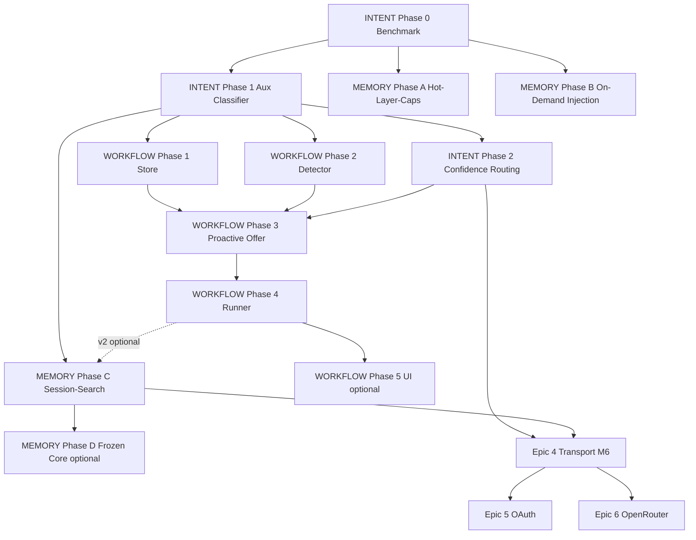

# Janus Agent Upgrade — Master-Roadmap (Intent → Learn → Memory → Provider)

**Version:** 1.2.1  
**Datum:** 2026-07-07  
**Zielgruppe:** Codex / Cursor / Operator  
**Status:** BINDING EXECUTION ORDER + CODEX PLANNING SOURCE OF TRUTH  

Dieses Dokument ist die **einzige Einstiegsdatei** für Codex zur Umsetzungsplanung. Bei Konflikten gilt diese Roadmap vor allen anderen Notizen. Detail-Specs werden pro Meilenstein verlinkt.

---

## 0. CODEX — START HERE

### 0.1 Aktueller Auftrag (verbindlich)

```text
STANDARD-PFAD (empfohlen, Operator-bestätigt 2026-07-07):

  JETZT:     M1 — Intent Phase 1 + Memory A+B (parallel erlaubt)
  DANN:      M2 — Intent Phase 2 abschließen
  DANN:      M3 — Learned Workflows
  DANN:      M4 — Memory Session-Search
  DANN:      M6 — Provider Transport Refactor
  DANN:      Epic 5 OAuth + Epic 6 OpenRouter (nach Transport Phase B)

NICHT JETZT:
  - Transport / OAuth / OpenRouter vor M4 (außer Operator-Go, siehe §0.4)
  - Transport vor Intent M2 (Recall-Zertifizierung und Diagnose unmöglich)
  - OpenRouter oder OAuth ohne Transport Phase B (kein Copy-Paste-Gateway bauen)
  - Delegation-Route-Härtung auf dem kritischen Pfad (nur Track B, siehe §0.8)
```

### 0.8 Codex-Delegation — Operating Model (bindend ab 2026-07-07)

Die **4-Choice cost-aware Delegation** ist EXIT PASS. Produktive Roadmap-Arbeit hat **immer Vorrang** vor weiterer Integrations- oder Härtungsarbeit.

**Binding handoff:**

`documentation/codex/model-routing/HANDOFF_DELEGATION_ROUTE_HARDENING_OPERATING_MODEL_2026-07-07.md`

**Kurzregeln für Codex bei `janus-executioner` / live Cursor:**

| Situation | Default |
|-----------|---------|
| Roadmap / Multi-File-Backend-Slice (z. B. M1.1) | **Codex lokal** — kein live Cursor auf Critical Path |
| Kleiner bounded Patch (≤2 allowlistete Dateien) | **3 = Cursor Composer** testen (Operator-OK) |
| Assist / Review / Doc | **4 = Cursor API** (Mini / GLM) |
| Delegation scheitert | Evidence loggen → **Codex implementieren** — max. 1× Composer + 1× API pro Task |
| Route-Härtung | **Track B** — max. 1 Item/Woche aus Hardening-Backlog, nie Roadmap blockieren |

Companion: `documentation/codex/model-routing/CURSOR_API_POOL_OPERATOR_PLAYBOOK_2026-07-07.md`

**Nicht verwechseln:** Dev-Delegation Option `2 = OpenRouter` ≠ Produkt-Epic 6 OpenRouter Provider.

### 0.2 Warum diese Reihenfolge (nicht blind, sondern begründet)

| Wenn du zuerst … | Problem |
|------------------|---------|
| **Transport** machst | Refactor ohne Messbasis — Provider-Bugs und Intent-Bugs sind nicht trennbar |
| **OpenRouter** machst | Fünftes Gateway, mehr Schuld; Skills fühlen sich trotzdem „pro Provider“ an |
| **Workflows** vor Intent M2 | Proaktives Offer auf schwachem Routing → falsche Routinen |
| **Intent M0** überspringst | Keine Baseline → +12 pp Behauptung nicht beweisbar |

**Provider-Schmerz heute ist zu ~50% Intent-Schmerz**, der wie Provider-Bug aussieht (Contact/Pet/Recall). Intent zuerst trennt die Ebenen.

**Merksatz:** Intent repariert das Gehirn. Transport repariert die Schienen. Schienen zuerst ohne Zugfahrplan = teurer.

### 0.3 Codex-Planungsworkflow (bei jeder neuen Session)

```text
1. Lies dieses Dokument vollständig §0 + aktuellen Meilenstein (§4)
2. Prüfe PROJECT_STATE.md / git log — welcher Meilenstein ist wirklich fertig?
3. Prüfe Exit-Kriterien des letzten Meilensteins — alle PASS?
4. Wähle genau EINEN Meilenstein-Slice (nicht zwei Orchestrator-Epics parallel auf main)
5. Lies die verlinkte Detail-Spec nur für diesen Slice
6. Bei janus-executioner / live Cursor: §0.8 + Delegation Operating Model lesen
7. Nutze den Codex-Prompt aus §15 (copy-paste)
8. Vor Merge: Operator-Checkliste §9 + janus-final-audit
9. Dokumentiere Exit in CURRENT_STATE + Entscheidungslog §17
```

### 0.4 Entscheidungsbaum — Standard vs. Ausnahme

```text
Codex blockiert an Cursor-Integration?
│
├─ JA → Hauptlinie PAUSIERT auf Integrations-Branch?
│        │
│        ├─ Operator will Parallel-Arbeit:
│        │     Branch B: nur Transport Phase A (T-A), Flag default false
│        │     Merge erst nach M2 Intent PASS + grüne Tests
│        │
│        └─ Sonst: warte auf Operator; kein anderes Epic auf main starten
│
├─ Operator will OpenRouter „sofort"?
│        └─ NEIN als Abkürzung. Pfad: M2 → M4 → Transport T-B → Epic 6
│
├─ Operator will Transport vor M4?
│        └─ Nur mit Operator-Go + M2 PASS + dokumentiertem Risiko
│           Workflows/Memory C danach → doppelte Orchestrator-Arbeit
│
└─ Standard: nächster offener Meilenstein in §4 der Reihe nach
```

### 0.5 Cursor-Integration blockiert — Parallel-Strategie

Wenn Codex an **Cursor-Integration** arbeitet und keinen Slot für Intent hat:

| Branch | Inhalt | Merge wann |
|--------|--------|------------|
| **main / develop** | Cursor-Integration bis fertig | — |
| **feature/intent-m0** | Intent Phase 0 (Benchmark) | Sobald Cursor-Slot frei oder parallel wenn kein Orchestrator-Konflikt |
| **feature/transport-ta** (optional) | Nur Transport Phase A | **Erst nach M2 Intent PASS** |

**Regeln für Parallel-Branch:**
- Kein Merge von Transport T-A in main vor M2
- Kein Intent Phase 1 + Transport T-A auf demselben Branch
- Flags bleiben `false` bis Operator Staging-Flip

### 0.6 Was Codex pro Meilenstein NICHT tun darf

| Verbot | Grund |
|--------|-------|
| Skill-JSONs für Provider anpassen | Skills sind kanonisch; Adapter/Transport trägt Provider-Unterschiede |
| Neues Gateway pro Provider (OR, Anthropic) | Epic 4 Transport ist Pflicht |
| `ChatOrchestrator.MODEL_HIERARCHY` weiter pflegen | Nur `MOA_MODEL_HIERARCHY` (ab Transport T-A) |
| Prod-Flags ohne Live-Retest flippen | §9 Checkliste |
| Workflows autonom speichern | User muss bestätigen (Workflows-Spec) |
| Frozen Core vor Session-Search stabil | M5 MD Go/No-Go |

### 0.7 Operator-Prioritäten (bindend)

| Prio | Aktion | Wer |
|------|--------|-----|
| **1** | M1 I1 + TASK-INTENT-M1.1 lokal in Codex | Codex (**JETZT**) |
| **2** | Memory A+B parallel zu M1 | Codex |
| **3** | M2 Intent PASS abwarten vor M3 Offer | — |
| **4** | M3 + M4 Kern-MVP | Codex |
| **5** | M6 Transport | Nach M4 |
| **6** | Epic 5 + 6 | Nach Transport T-B |
| **—** | Codex-Delegation 4-Choice | **EXIT PASS** 2026-07-07 |
| **—** | Delegation Route-Härtung (Track B) | Background, max. 1 Slice/Woche, §0.8 |

---

## 1. Verknüpfte Specs

| Epic / Handoff | Dokument | ID | Reihenfolge |
|------|----------|---------|-------------|
| Codex Delegation Operating Model | [../codex/model-routing/HANDOFF_DELEGATION_ROUTE_HARDENING_OPERATING_MODEL_2026-07-07.md](../codex/model-routing/HANDOFF_DELEGATION_ROUTE_HARDENING_OPERATING_MODEL_2026-07-07.md) | `HANDOFF-DELEGATION-OPS` | **bei janus-executioner** |
| Intent Engine Upgrade | [INTENT_ENGINE_HERMES_INSPIRED_UPGRADE_PLAN.md](./INTENT_ENGINE_HERMES_INSPIRED_UPGRADE_PLAN.md) | `EPIC-INTENT-HERMES-001` | **1** |
| Learned Workflows | [LEARNED_WORKFLOWS_SPEC.md](./LEARNED_WORKFLOWS_SPEC.md) | `EPIC-WORKFLOW-001` | **2** |
| Memory Upgrade | [MEMORY_HERMES_INSPIRED_UPGRADE_PLAN.md](./MEMORY_HERMES_INSPIRED_UPGRADE_PLAN.md) | `EPIC-MEM-HERMES-001` | **3** |
| Provider Transport Refactor | [PROVIDER_TRANSPORT_REFACTOR_SPEC.md](./PROVIDER_TRANSPORT_REFACTOR_SPEC.md) | `EPIC-ARCH-TRANSPORT-001` | **4 (Infrastruktur)** |
| ChatGPT OAuth Provider | [CHATGPT_OAUTH_PROVIDER_SPEC.md](./CHATGPT_OAUTH_PROVIDER_SPEC.md) | `EPIC-AUTH-CHATGPT-001` | **5 (später)** |
| OpenRouter Provider | [OPENROUTER_PROVIDER_SPEC.md](./OPENROUTER_PROVIDER_SPEC.md) | `EPIC-PROVIDER-OPENROUTER-001` | **6 (später)** |

---

## 2. Strategische Reihenfolge (Kurz)

```text
INTENT (Fundament — misst und repariert Routing)
    ↓
LEARNED WORKFLOWS (prozedural, Janus bietet Routinen an)
    ↓
MEMORY groß (Session-Search, optional Frozen Core)
    ↓
PROVIDER TRANSPORT (Architektur — Hermes-inspiriert, 3–4 API-Familien)
    ↓
CHATGPT OAUTH + OPENROUTER (nutzen Transport, kein neues Gateway pro Provider)
```

**Parallel erlaubt:** Memory Phase A+B während Intent Phase 1 (risikoarm, kein Blocker).

**Provider-Epics:** Erst Transport (Epic 4), dann OAuth (5) und OpenRouter (6). OAuth und OR können nach Transport Phase B teilweise parallel.

---

## 3. Abhängigkeitsgraph



**Leseregel:** Pfeil = „sollte vorher fertig sein“. Gestrichelt = optional / v2.

**Provider-Zweig:** Epic 4–6 starten nach M4 (Standard) oder nach M2 + Operator-Go (nur Transport T-A auf Branch). Epic 5 und 6 **müssen** Transport Phase B haben.

---

## 4. Meilenstein-Plan (verbindlich)

### M0 — Messbarkeit (Woche 1) ← **JETZT**

| ID | Arbeit | Spec | Aufwand | Risiko | Flag Default |
|----|--------|------|---------|--------|--------------|
| **I0** | Intent-Benchmark-Suite (80+ Cases) | Intent §4 | 2–3 Tage | Niedrig | — |
| **I0-B** | Baseline-Report dokumentieren | Intent §4.6 | 0,5 Tag | Niedrig | — |

**Exit:**
- `INTENT_BENCHMARK_BASELINE.md` existiert
- CI-laufbar (`pytest` Benchmark-Suite grün)
- Contact/Pet/Recall/Calendar Teilmengen getrennt ausgewiesen

**Go/No-Go für M1:** Baseline existiert — sonst keine Intent-Änderung.

**Codex-Prompt:** → §15.1

---

### M1 — Intent-Kern + Memory Quick Wins (Woche 1–3)

| ID | Arbeit | Spec | Aufwand | Risiko | Parallel? |
|----|--------|------|---------|--------|-----------|
| **I1** | Auxiliary Action/Subject Classifier | Intent §5 | 1,5–2 Wo. | Mittel | — |
| **MA** | Hot-Layer-Caps | Memory §4 | 1–2 Tage | Niedrig | ✅ parallel zu I1 |
| **MB** | On-Demand Memory Injection | Memory §5 | 1–2 Tage | Niedrig | ✅ parallel zu I1 |

**Exit I1:**
- Benchmark Contact/Pet/Recall: **≥ +12 pp** vs. M0-Baseline
- `INTENT_AUX_CLASSIFIER_ENABLED` auf Staging `true`
- `test_calendar_routing_fix.py` grün

**Exit MA/MB:**
- Flags auf Staging `true`
- Keine Medical-Regression

**Go/No-Go für M2:** I1 Exit PASS.

**Codex-Prompts:** → §15.2, §15.3

---

### M2 — Intent abschließen (Woche 3–4)

| ID | Arbeit | Spec | Aufwand | Risiko |
|----|--------|------|---------|--------|
| **I2** | Confidence-Routing (Ambiguity sanft) | Intent §6 | 3–5 Tage | Mittel |
| **I3** | Regex-Freeze (optional) | Intent §7 | 2–3 Tage | Niedrig |

**Exit:**
- Ambiguity FP: **−30–50%**
- Gesamt-Benchmark: **≥ +7 pp** vs. M0-Baseline
- Live-Retest L1–L7 (Intent-Spec §11.2): **7/7**

**Go/No-Go für M3:** Intent MVP PASS → sonst **kein** Workflow-Offer live.

**Go/No-Go für Transport-Branch (optional):** M2 PASS → `feature/transport-ta` Merge erlaubt.

**Codex-Prompt:** → §15.4

---

### M3 — Learned Workflows MVP (Woche 4–8)

| ID | Arbeit | Spec | Aufwand | Risiko |
|----|--------|------|---------|--------|
| **L1** | Routine-Store + Schema | Workflows §7 Ph.1 | 2–3 Tage | Niedrig |
| **L2** | Workflow-Detector | Workflows §7 Ph.2 | 3–5 Tage | Mittel |
| **L3** | **Proaktives Offer** + Dialog | Workflows §7 Ph.3 | 3–4 Tage | Mittel |
| **L4** | Routine-Runner | Workflows §7 Ph.4 | 1–1,5 Wo. | Mittel |

**Exit:**
- Janus bietet nach Multi-Step-Erfolg Routine an (nicht User-initiiert nötig)
- „Ja“ → gespeichert; „Nein“ → Cooldown
- Trigger „Morgen-Routine“ führt Steps aus
- Live L1–L8 (Workflows §10.2): **8/8**

**Codex-Prompts:** → §15.5, §15.6

---

### M4 — Memory groß (Woche 8–10)

| ID | Arbeit | Spec | Aufwand | Risiko |
|----|--------|------|---------|--------|
| **MC** | Session-Search FTS5 | Memory §6 | 1–2 Wo. | Mittel |
| **ME** | USER.md Core-Export (optional) | Memory §8 | 2–3 Tage | Niedrig |

**Exit MC:**
- `session_search` Tool on-demand
- „Was haben wir über X besprochen?“ funktioniert
- Sanitizer aktiv, Flag Staging `true`

**Go/No-Go für M6 Transport:** M4 MC Exit PASS (Standard) oder Operator-Go mit Risiko.

**Codex-Prompt:** → §15.7

---

### M5 — Optional / Polish (Woche 10+)

| ID | Arbeit | Spec | Aufwand | Risiko |
|----|--------|------|---------|--------|
| **MD** | Frozen Core | Memory §7 | 3–5 Tage | **Hoch** |
| **I4** | Entity-First Routing | Intent §8 | 1–1,5 Wo. | Mittel |
| **LU** | Routinen-UI | Workflows §7 Ph.5 | 1 Wo. | Niedrig |
| **I5** | `/skipdetect` Bypass | Intent §9 | 1 Tag | Niedrig |

**MD Go/No-Go:** Nur wenn MC 1 Woche stabil + Prefix-Cache-Gewinn gemessen.

**Hinweis:** M5 ist **nicht** Blocker für M6 Transport.

---

### M6 — Provider Transport (Woche 10–13)

| ID | Arbeit | Spec | Aufwand | Risiko |
|----|--------|------|---------|--------|
| **T-A** | Konsolidierung: ToolLoopRunner + eine MODEL_HIERARCHY | Transport §4 Ph.A | 1–1,5 Wo. | Mittel-Hoch |
| **T-B** | Transport-Schicht (openai_compat, gemini_native, ollama) | Transport §4 Ph.B | 1–1,5 Wo. | Mittel-Hoch |
| **T-C** | Websearch-Entkopplung + Cleanup | Transport §4 Ph.C | 3–5 Tage | Mittel |

**Exit:**
- OpenAI + Gemini laufen über `ToolLoopRunner` + Transport
- `provider ==` Branches in Gateways/Orchestrator: **<10**
- Live T-L1–T-L8 (Transport §10): **8/8**
- `janus-final-audit` PASS

**Go/No-Go für Epic 5+6:** Transport Phase B (T-B) PASS.

**Codex-Prompts:** → §15.8, §15.9, §15.10

---

## 5. Gesamt-Timeline

| Meilenstein | Kalender (1 Dev, Vollzeit) | Kumuliert |
|-------------|---------------------------|-----------|
| M0 Benchmark | Woche 1 | 1 Wo. |
| M1 Intent + Memory A/B | Woche 1–3 | 3 Wo. |
| M2 Intent I2 | Woche 3–4 | 4 Wo. |
| M3 Workflows | Woche 4–8 | 8 Wo. |
| M4 Memory C | Woche 8–10 | 10 Wo. |
| M5 Optional | Woche 10+ | 12+ Wo. |
| M6 Transport | Woche 10–13 | 13 Wo. |
| Epic 5 OAuth | Woche 13–15 | 15 Wo. |
| Epic 6 OpenRouter | Woche 15–18 | 18 Wo. |

**Realistisch Kern-MVP (Intent + Workflows + Memory C):** ~**10 Wochen**  
**Mit Provider-Stack (Transport + OAuth + OR Launch):** ~**18 Wochen**  
**Mit nur Intent + Workflows (ohne Session-Search):** ~**8 Wochen**

**Mit Codex + aktivem Operator-Testing:** Kern-MVP ~**5–7 Wochen** (wie in Specs geschätzt).

---

## 6. Feature-Flag-Rollout (Staging → Prod)

| Flag | Einführen bei | Default bis Prod |
|------|---------------|------------------|
| `INTENT_AUX_CLASSIFIER_ENABLED` | M1 Exit | `false` |
| `INTENT_CONFIDENCE_ROUTING_ENABLED` | M2 Exit | `false` |
| `MEMORY_HOT_LAYER_CAP_ENABLED` | M1 (MA) | `false` |
| `MEMORY_ON_DEMAND_INJECTION_ENABLED` | M1 (MB) | `false` |
| `ROUTINES_ENABLED` | M3 L1 | `false` |
| `ROUTINES_PROACTIVE_OFFER_ENABLED` | M3 L3 | `false` |
| `ROUTINES_EXECUTION_ENABLED` | M3 L4 | `false` |
| `MEMORY_SESSION_SEARCH_ENABLED` | M4 MC | `false` |
| `MEMORY_FROZEN_CORE_ENABLED` | M5 MD | `false` |
| `TRANSPORT_TOOL_LOOP_RUNNER_ENABLED` | M6 T-A Exit | `false` |
| `TRANSPORT_LAYER_ENABLED` | M6 T-B Exit | `false` |
| `TRANSPORT_WEBSEARCH_DECOUPLED` | M6 T-C Exit | `false` |
| `OPENAI_CODEX_OAUTH_ENABLED` | Epic 5 A3 | `false` |
| `OPENROUTER_PROVIDER_ENABLED` | Epic 6 OR4 | `false` |

**Prod-Flip:** Pro Flag nur nach Live-Retest + `janus-final-audit` PASS für den jeweiligen Epic-Slice.

---

## 7. Was parallel geht / was nicht

| Parallel erlaubt | Nicht parallel |
|------------------|----------------|
| MA + MB während I1 | L3 Offer vor I1 Exit |
| I2 nach I1 gestartet | MC vor I0 Benchmark |
| LU (UI) während L4 stabilisiert | MD vor MC stabil |
| ME (Export) jederzeit nach MA | Autonomes Speichern von Routinen (nie) |
| Epic 5 OAuth nach Transport T-B | OAuth vor Transport Phase B |
| Epic 6 OR nach Transport T-B | OR als fünftes Gateway bauen |
| Transport T-A auf Branch nach M2 PASS | Transport T-A Merge vor M2 |
| Cursor-Integration + M0 auf getrennten Branches | Intent M1 + Transport T-A gleicher Branch |
| Transport T-A Branch während M3/M4 | Transport T-B/C vor M4 ohne Operator-Go |

---

## 8. Erwarteter Gesamt-Effekt (nach MVP)

| Dimension | Heute (geschätzt) | Nach Roadmap |
|-----------|-------------------|--------------|
| Intent-Routing gesamt | ~78–83% | ~88–92% |
| Contact/Pet/Recall | ~65–75% | ~90–95% |
| Episodisches „was besprochen“ | ~0% (nicht vorhanden) | ~80–85% (Keyword-FTS) |
| Wiederkehrende Multi-Step-Tasks | jedes Mal neu | 1 Trigger (Routine) |
| Fehl-Klärungsfragen | hoch | −30–50% |
| Neuer Provider-Aufwand | ~2 Wo./Provider | **2–4 Tage** (nach Transport) |
| Skill-Änderung pro Provider | gefühlt hoch | **0** (nur Tier-Key) |

---

## 9. Operator-Checkliste pro Meilenstein

```text
□ Benchmark / Tests grün
□ Exit-Kriterien des Meilensteins (§4) alle PASS
□ Feature-Flag Staging on (wenn applicable)
□ Live-Retest-Szenarien PASS (Spec-Referenz in §4)
□ Medical / Policy Regression PASS
□ janus-final-audit PASS (oder dokumentiertes Go mit Risiko)
□ CURRENT_STATE + WHAT_I_LEARNED aktualisiert
□ Prod-Flag-Flip bewusst entschieden (nicht automatisch)
□ Nächster Meilenstein in §0.1 / §16 aktualisiert
```

---

## 10. Diagnose: Provider-Bug oder Intent-Bug?

Codex und Operator nutzen diese Tabelle **vor** Skill- oder Provider-Änderungen:

| Symptom | Wahrscheinliche Ebene | Erst fixen in |
|---------|----------------------|---------------|
| Kontaktname falsch aufgelöst | Intent / Entity | M1–M2 Intent |
| `besitzt` vs `hat` falscher Pfad | Intent | M1 Classifier |
| Tool-Name `system_websearch` vs `system.websearch` | Transport/Adapter | M6 Transport |
| Websearch auf falschem Provider | Transport/Websearch | M6 T-C |
| Gemini Grounding fehlt | Post-Processor | M6 Transport |
| Kalender-Veto falsch | Intent (Regex) | M1–M2 Intent |
| Modell ignoriert tool_choice | Provider/Transport | M6 + Zertifizierung |
| Skill funktioniert mit GPT, nicht Gemini (gleicher Intent) | Transport | M6 Parity-Test |

**Regel:** Ohne M0-Baseline keine Aussage „Intent regressed“ oder „Provider regressed“.

---

## 11. Epic 4 — Provider Transport (nach M4, Infrastruktur)

| ID | Arbeit | Spec | Aufwand |
|----|--------|------|---------|
| **T-A** | ToolLoopRunner + MODEL_HIERARCHY vereinheitlichen | Transport §4 Ph.A | 1–1,5 Wo. |
| **T-B** | Transport-Schicht + runtime_llm.resolve() | Transport §4 Ph.B | 1–1,5 Wo. |
| **T-C** | Websearch-Entkopplung + Parity-Tests | Transport §4 Ph.C | 3–5 Tage |

**Exit:** Provider-Unterschiede in 3–4 Transports gekapselt; Skills unverändert; OpenAI/Gemini Parity grün.

**Start Standard:** M4 Exit. **Start Ausnahme:** M2 PASS + Operator-Go nur für T-A auf Branch.

**Warum vor OAuth/OR:** Epic 5 und 6 werden **2–4 Tage** statt **2 Wochen** — kein Copy-Paste-Gateway pro Provider.

---

## 12. Epic 5 — ChatGPT OAuth (nach Transport Phase B)

| ID | Arbeit | Spec | Aufwand |
|----|--------|------|---------|
| **A1** | OAuth Device-Flow + Token-Store | ChatGPT OAuth §7 Ph.1 | 4–5 Tage |
| **A2** | `codex_responses` Transport + Provider | ChatGPT OAuth §7 Ph.2 + Transport §3 | 3–4 Tage |
| **A3** | Settings UI | ChatGPT OAuth §7 Ph.3 | 2–3 Tage |

**Exit:** Plus-User chatten mit Tools ohne API-Key. Nutzt `CodexResponsesTransport` — kein separater Tool-Loop.

**Codex-Prompt:** → §15.11

---

## 13. Epic 6 — OpenRouter Provider (nach Transport Phase B)

| ID | Arbeit | Spec | Aufwand |
|----|--------|------|---------|
| **OR1** | Keyring + Certified Registry + `openai_compat` OR base_url | OpenRouter §8 Ph.1 + Transport | 2–3 Tage |
| **OR2** | Settings UI + Orchestrator-Routing | OpenRouter §8 Ph.2 | 2–3 Tage |
| **OR3** | Conformance Runner C01–C10 | OpenRouter §4 + §8 Ph.3 | 3–4 Tage |
| **OR4** | Launch-Zertifizierung (4 Modelle) | OpenRouter §5.1 + §8 Ph.4 | 3–5 Tage |
| **OR5** | Erweiterung Qwen/Kimi/GLM (optional) | OpenRouter §5.2 + §8 Ph.5 | 1–2 Wo. |

**Exit:** User mit OR-Key wählt nur Janus-Certified-Modelle — jedes unterstützt vollen Funktionsumfang.

**Launch-Modelle (Ziel):** Claude Sonnet 4, Claude Haiku 3.5, DeepSeek V3.1, DeepSeek v4-flash.

**Codex-Prompts:** → §15.12, §15.13

---

## 14. Schnellreferenz — Nächster Schritt

| Situation | Nächster Schritt |
|-----------|------------------|
| **Normal (empfohlen)** | M0 Intent Benchmark → §15.1 |
| Codex frei, Cursor fast fertig | M0 auf `feature/intent-m0` |
| Codex nur Cursor-Integration | Cursor fertig machen; M0 vorbereiten |
| M0 fertig | M1 I1 + parallel MA/MB → §15.2–15.3 |
| M2 PASS, Wartezeit bis M4 | Optional: Transport T-A Branch → §15.8 |
| M4 fertig | M6 Transport T-A → §15.8 |
| Transport T-B fertig | Epic 5 + 6 planen → §15.11–15.13 |

---

## 15. Codex-Prompts (copy-paste)

### 15.1 M0 — Intent Benchmark (JETZT)

```text
Du arbeitest am Janus-Projekt. Lies zuerst:
- documentation/Cursor specs/ROADMAP_EPIC_ORDER.md §0 und §4 M0
- documentation/Cursor specs/INTENT_ENGINE_HERMES_INSPIRED_UPGRADE_PLAN.md §4

Aufgabe: Implementiere INTENT Phase 0 (Benchmark-Suite + Baseline-Report).

Constraints:
- Keine Intent-Engine-Logik ändern — nur messen
- 80+ Cases, Teilmengen Contact/Pet/Recall/Calendar getrennt
- Output: INTENT_BENCHMARK_BASELINE.md + CI-laufbare pytest-Suite
- Kein Transport, kein OAuth, kein OpenRouter
- janus-preimplementation-check vor Code-Änderungen

Exit prüfen: §4 M0 Exit-Kriterien + §9 Operator-Checkliste
```

### 15.2 M1 — Intent Phase 1

```text
Du arbeitest am Janus-Projekt. Lies zuerst:
- documentation/Cursor specs/ROADMAP_EPIC_ORDER.md §4 M1
- documentation/Cursor specs/INTENT_ENGINE_HERMES_INSPIRED_UPGRADE_PLAN.md §5

Aufgabe: Implementiere INTENT Phase 1 (Auxiliary Action/Subject Classifier).

Constraints:
- M0 Baseline muss existieren — Benchmark vor/nach vergleichen
- Ziel: Contact/Pet/Recall ≥ +12 pp vs. Baseline
- INTENT_AUX_CLASSIFIER_ENABLED=false default
- Keine neuen Regex-Listen (Regex-Freeze-Vorbereitung)
- Kein Transport/OAuth/OR

Exit: §4 M1 I1 Exit + test_calendar_routing_fix.py grün
```

### 15.3 M1 — Memory Phase A+B (parallel)

```text
Du arbeitest am Janus-Projekt. Lies zuerst:
- documentation/Cursor specs/ROADMAP_EPIC_ORDER.md §4 M1
- documentation/Cursor specs/MEMORY_HERMES_INSPIRED_UPGRADE_PLAN.md §4–5

Aufgabe: Implementiere MEMORY Phase A (Hot-Layer-Caps) + Phase B (On-Demand Injection).

Constraints:
- Parallel zu Intent M1 erlaubt — kein Orchestrator-Konflikt mit I1 anstoßen
- Flags default false
- Medical-Regression muss PASS bleiben
- Kein Session-Search (das ist M4)

Exit: §4 M1 MA/MB Exit
```

### 15.4 M2 — Intent Phase 2

```text
Du arbeitest am Janus-Projekt. Lies zuerst:
- documentation/Cursor specs/ROADMAP_EPIC_ORDER.md §4 M2
- documentation/Cursor specs/INTENT_ENGINE_HERMES_INSPIRED_UPGRADE_PLAN.md §6–7

Aufgabe: Implementiere INTENT Phase 2 (Confidence-Routing) + optional Phase 3 (Regex-Freeze).

Constraints:
- M1 Exit muss PASS sein
- Ambiguity FP −30–50%; Gesamt-Benchmark ≥ +7 pp vs. M0
- Live-Retest L1–L7 (Intent-Spec §11.2): 7/7
- Go/No-Go für M3: bei FAIL kein Workflow-Offer

Exit: §4 M2 + Intent-Spec §11.2
```

### 15.5 M3 — Workflows Phase 1+2

```text
Du arbeitest am Janus-Projekt. Lies zuerst:
- documentation/Cursor specs/ROADMAP_EPIC_ORDER.md §4 M3
- documentation/Cursor specs/LEARNED_WORKFLOWS_SPEC.md §7 Ph.1–2

Aufgabe: Implementiere WORKFLOW Phase 1 (Store) + Phase 2 (Detector).

Constraints:
- M2 Intent Go/No-Go muss PASS sein
- ROUTINES_ENABLED=false default
- Nur CapabilityRegistry-Skills — keine autonomen Skill-Erfindungen
- Kein proaktives Offer yet (das ist L3)

Exit: §4 M3 L1+L2
```

### 15.6 M3 — Workflows Phase 3+4

```text
Du arbeitest am Janus-Projekt. Lies zuerst:
- documentation/Cursor specs/ROADMAP_EPIC_ORDER.md §4 M3
- documentation/Cursor specs/LEARNED_WORKFLOWS_SPEC.md §7 Ph.3–4

Aufgabe: Implementiere WORKFLOW Phase 3 (Proaktives Offer) + Phase 4 (Runner).

Constraints:
- User muss „Ja" sagen — nie autonom speichern
- ROUTINES_PROACTIVE_OFFER_ENABLED nur Staging nach M2 PASS
- Live L1–L8: 8/8

Exit: §4 M3 vollständig
```

### 15.7 M4 — Memory Session-Search

```text
Du arbeitest am Janus-Projekt. Lies zuerst:
- documentation/Cursor specs/ROADMAP_EPIC_ORDER.md §4 M4
- documentation/Cursor specs/MEMORY_HERMES_INSPIRED_UPGRADE_PLAN.md §6

Aufgabe: Implementiere MEMORY Phase C (Session-Search FTS5).

Constraints:
- Sanitizer aktiv
- MEMORY_SESSION_SEARCH_ENABLED=false default
- Kein Frozen Core (M5)

Exit: §4 M4 MC
```

### 15.8 M6 — Transport Phase A

```text
Du arbeitest am Janus-Projekt. Lies zuerst:
- documentation/Cursor specs/ROADMAP_EPIC_ORDER.md §0.4, §4 M6, §11
- documentation/Cursor specs/PROVIDER_TRANSPORT_REFACTOR_SPEC.md §4 Ph.A

Aufgabe: Implementiere Transport Phase A (ToolLoopRunner + eine MODEL_HIERARCHY).

Constraints:
- M4 Exit PASS (Standard) ODER M2 PASS + Operator-Go (nur Branch)
- TRANSPORT_TOOL_LOOP_RUNNER_ENABLED=false default
- KEINE Skill-JSON-Änderungen
- ChatOrchestrator.MODEL_HIERARCHY entfernen/vereinheitlichen
- OpenAI + Gemini Tests grün

Exit: §4 M6 T-A + Transport-Spec Exit A
```

### 15.9 M6 — Transport Phase B

```text
Du arbeitest am Janus-Projekt. Lies zuerst:
- documentation/Cursor specs/PROVIDER_TRANSPORT_REFACTOR_SPEC.md §4 Ph.B

Aufgabe: Implementiere Transport Phase B (openai_compat, gemini_native, ollama_local, runtime_llm.resolve).

Constraints:
- Phase A Exit PASS
- TRANSPORT_LAYER_ENABLED=false default
- Kein OpenRouter/OAuth in diesem Slice — nur Infrastruktur
- Gateways werden dünn — Logik in ToolLoopRunner + Transport

Exit: §4 M6 T-B — Go/No-Go für Epic 5+6
```

### 15.10 M6 — Transport Phase C

```text
Du arbeitest am Janus-Projekt. Lies zuerst:
- documentation/Cursor specs/PROVIDER_TRANSPORT_REFACTOR_SPEC.md §4 Ph.C, §10

Aufgabe: Implementiere Transport Phase C (Websearch-Entkopplung, Post-Processors, Parity-Tests).

Constraints:
- Phase B Exit PASS
- Live T-L1–T-L8: 8/8
- provider== Branches in Gateways/Orchestrator <10

Exit: §4 M6 vollständig + janus-final-audit PASS
```

### 15.11 Epic 5 — ChatGPT OAuth

```text
Du arbeitest am Janus-Projekt. Lies zuerst:
- documentation/Cursor specs/ROADMAP_EPIC_ORDER.md §12
- documentation/Cursor specs/CHATGPT_OAUTH_PROVIDER_SPEC.md
- documentation/Cursor specs/PROVIDER_TRANSPORT_REFACTOR_SPEC.md §3 (CodexResponsesTransport)

Aufgabe: Implementiere Epic 5 (OAuth + codex_responses Transport + Settings UI).

Constraints:
- Transport Phase B MUSS PASS sein — kein separater Tool-Loop
- OPENAI_CODEX_OAUTH_ENABLED=false default
- API-Key-Pfad bleibt parallel
- codex_app_server NICHT — nur codex_responses

Exit: §12 Epic 5
```

### 15.12 Epic 6 — OpenRouter Phase 1–2

```text
Du arbeitest am Janus-Projekt. Lies zuerst:
- documentation/Cursor specs/ROADMAP_EPIC_ORDER.md §13
- documentation/Cursor specs/OPENROUTER_PROVIDER_SPEC.md §3–8 Ph.1–2
- documentation/Cursor specs/PROVIDER_TRANSPORT_REFACTOR_SPEC.md (OpenAICompatTransport)

Aufgabe: Implementiere OpenRouter Keyring + Certified Registry + Settings UI.

Constraints:
- Transport Phase B MUSS PASS sein
- Nutze OpenAICompatTransport — KEIN neues Gateway
- OPENROUTER_CERTIFIED_ONLY=true — nur Registry-Modelle in UI
- Kein Volllisten-Import aus OR-Katalog

Exit: §13 OR1+OR2
```

### 15.13 Epic 6 — OpenRouter Zertifizierung

```text
Du arbeitest am Janus-Projekt. Lies zuerst:
- documentation/Cursor specs/OPENROUTER_PROVIDER_SPEC.md §4–5, §8 Ph.3–4

Aufgabe: Implementiere Conformance Runner C01–C10 + Launch-Zertifizierung (4 Modelle).

Constraints:
- Batterie C01–C10 alle PASS vor certified=true in Registry
- Launch: Claude Sonnet 4, Claude Haiku 3.5, DeepSeek V3.1, DeepSeek v4-flash
- Live OR-L1–L8: 8/8
- OPENROUTER_PROVIDER_ENABLED=false bis Operator Prod-Flip

Exit: §13 Epic 6 vollständig
```

---

## 16. Fortschritts-Tracker (von Codex/Operator pflegen)

| Meilenstein | Status | Datum | Notizen |
|-------------|--------|-------|---------|
| M0 Intent Benchmark | **EXIT PASS** | 2026-07-07 | Baseline `documentation/test-runs/INTENT_BENCHMARK_BASELINE.md`, pytest suite gruen, go fuer M1 |
| Codex Delegation 4-Choice | **EXIT PASS** | 2026-07-07 | Gate live; Operating Model `HANDOFF_DELEGATION_ROUTE_HARDENING_OPERATING_MODEL_2026-07-07.md` |
| M1 I1 / TASK-INTENT-M1.1 | **EXIT PASS** | 2026-07-08 | Cursor Composer/API nur als Evidence behalten; Slice lokal in Codex abgeschlossen, final auditiert und dokumentiert |
| M1 I1 / TASK-INTENT-M1.2 | **EXIT PASS** | 2026-07-08 | Integrationskern lokal in Codex abgeschlossen; Live-DB-Kontamination bereinigt, Gemini-Recall-Fallback gehaertet, final auditiert und dokumentiert |
| M1 I1 Intent Classifier | IN ARBEIT | 2026-07-08 | M1.1 und M1.2 PASS; M1.3 Benchmark-/Latency-Proof und Staging-Enablement noch offen |
| M1 MA/MB Memory A+B | OFFEN | — | parallel zu I1 |
| M2 Intent I2 | OFFEN | — | |
| M3 Workflows | OFFEN | — | |
| M4 Memory C | OFFEN | — | |
| M6 Transport T-A | OFFEN | — | nach M4 |
| M6 Transport T-B | OFFEN | — | |
| M6 Transport T-C | OFFEN | — | |
| Epic 5 OAuth | OFFEN | — | nach T-B |
| Epic 6 OpenRouter | OFFEN | — | nach T-B |

**Status-Werte:** `OFFEN` | `IN ARBEIT` | `EXIT PASS` | `BLOCKIERT (Grund)`

---

## 17. Entscheidungslog

| Datum | Entscheidung |
|-------|--------------|
| 2026-07-07 | Reihenfolge: Intent → Learn → Memory (groß) |
| 2026-07-07 | Memory A+B parallel zu Intent erlaubt |
| 2026-07-07 | Workflows: Janus bietet proaktiv an, User bestätigt |
| 2026-07-07 | Frozen Core erst nach Session-Search stabil |
| 2026-07-07 | Provider Transport Refactor als Epic 4 nach M4 (Hermes-inspiriert) |
| 2026-07-07 | ChatGPT OAuth als Epic 5 nach Transport Phase B |
| 2026-07-07 | OpenRouter Certified-Only als Epic 6 nach Transport Phase B |
| 2026-07-07 | Transport vor Provider-Expansion: 3–4 API-Familien statt N Gateways |
| 2026-07-07 | **Standard-Pfad:** M0→M4 der Reihe nach; Transport nicht vor M4 |
| 2026-07-07 | **Ausnahme:** Transport T-A auf Branch nach M2 PASS, wenn Codex blockiert |
| 2026-07-07 | **Verbot:** OpenRouter/OAuth ohne Transport T-B |
| 2026-07-07 | Roadmap = Codex Planning Source of Truth (§0) |
| 2026-07-07 | Codex-Delegation 4-Choice EXIT PASS; Härtung = Track B, Produkt = Track A |
| 2026-07-07 | M1.1: Multi-File-Backend-Slices → Codex lokal; Cursor nur ≤2 allowlistete Dateien |
| 2026-07-07 | `HANDOFF_DELEGATION_ROUTE_HARDENING_OPERATING_MODEL_2026-07-07.md` bindend bei live Cursor |

---

**END OF ROADMAP**
